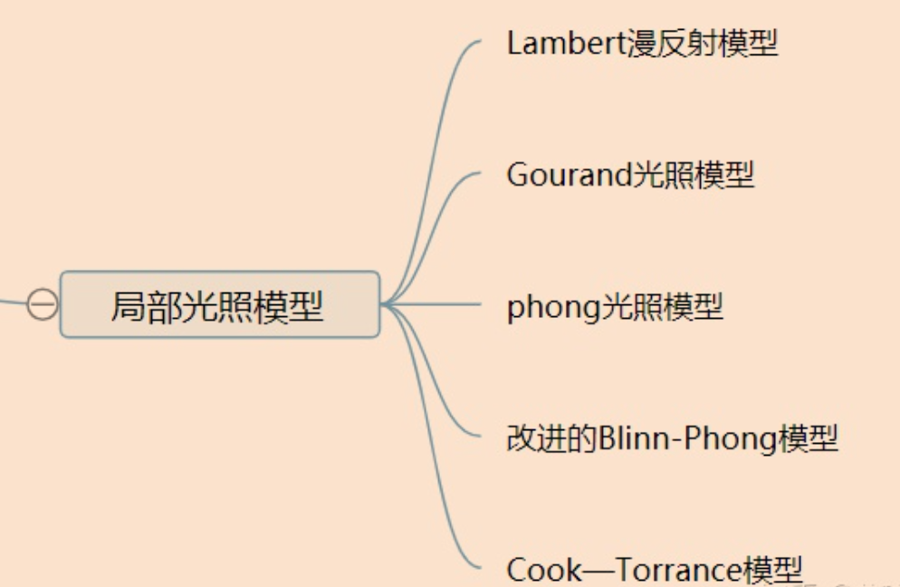
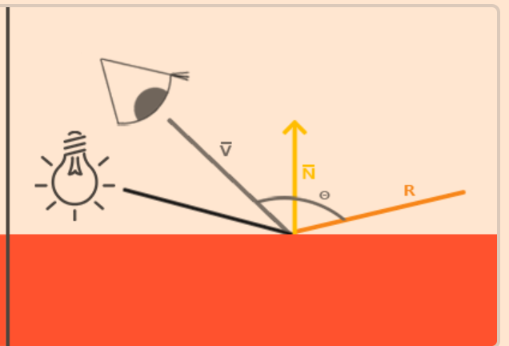
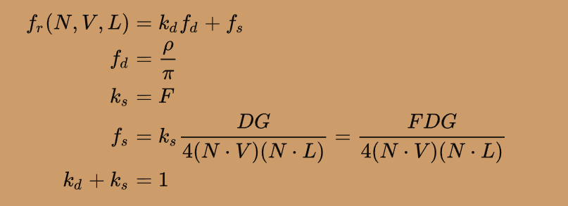

# C++

## 现代C++

### 语言可用性强化

* 引入了nullptr、constexpr、auto、using等
* 在面向对象上，引入了继承构造、委托构造。

### 模板

* **引入了变长参数模板**

* **模板为什么声明和定义不能分离**

C++是分离式编译，编译是对每一个cpp文件而言的，将cpp编译成独立的obj，再将obj进行链接生成exe可执行程序，对于模板而言，模板只有被调用的时候才会被实例化，如果将声明和定义分开放，那么模板函数不会被实例化，就会发生链接错误。

### 语言运行期强化

* **Lambda表达式**

实际上就是提供了一个类似匿名函数的特性， 而匿名函数则是在需要一个函数，但是又不想费力去命名一个函数的情况下去使用的。这样的场景其实有很多很多， 所以匿名函数几乎是现代编程语言的标配。

* **右值引用**

右值就是右边的值，指的是表达式结束后就不再存在的临时对象。

* **移动语义与完美转发**

传统 C++ 通过拷贝构造函数和赋值操作符为类对象设计了拷贝/复制的概念，但为了实现对资源的移动操作， 调用者必须使用先复制、再析构的方式，浪费时间。

直接通过右值引用，接管将亡值的资源管理，延长生命周期。

完美转发:

```cpp
#include <iostream>
#include <utility>
void reference(int& v) {
    std::cout << "左值引用" << std::endl;
}
void reference(int&& v) {
    std::cout << "右值引用" << std::endl;
}
template <typename T>
void pass(T&& v) {
    std::cout << "              普通传参: ";
    reference(v);
    std::cout << "       std::move 传参: ";
    reference(std::move(v));
    std::cout << "    std::forward 传参: ";
    reference(std::forward<T>(v));
    std::cout << "static_cast<T&&> 传参: ";
    reference(static_cast<T&&>(v));
}
int main() {
    std::cout << "传递右值:" << std::endl;
    pass(1);

    std::cout << "传递左值:" << std::endl;
    int v = 1;
    pass(v);

    return 0;
}
```

### 智能指针与内存管理

智能指针都遵循RAII原理，RAII是对资源申请、释放的操作的一种封装。

#### shared_ptr

* 是一种强引用智能指针，能够记录多少个`shadred_ptr`共同指向一个对象，当引用计数为0的时候对象会自动删除。

```cpp
template<typename T>
class smart
{
private:
	T* _ptr;
	int* _count; //reference couting

public:
	//构造函数
	smart(T* ptr = nullptr) :_ptr(ptr)
	{
		if (_ptr)
		{
			_count = new int(1);
		}
		else
		{
			_count = new int(0);
		}
	}

	//拷贝构造
	smart(const smart& ptr)
	{
		if (this != &ptr)
		{
			this->_ptr = ptr._ptr;
			this->_count = ptr._count;

			(*this->_count)++;
		}
	}

	//重载operator=
	smart& operator=(const smart & ptr)
	{
		if (this->_ptr == ptr._ptr)
		{
			return *this;
		}
		if (this->_ptr)
		{
			(*this->_count)--;
			if (*this->_count == 0)
			{
				delete this->_ptr;
				delete this->_count;
			}
		}
		this->_ptr = ptr._ptr;
		this->_count = ptr._count;
		(*this->_count)++;
		return *this;
	}

	//operator*重载
	T& operator*()
	{
		if (this->_ptr)
		{
			return *(this->_ptr);
		}
	}

	//operator->重载
	T* operator->()
	{
		if (this->_ptr)
		{
			return this->_ptr;
		}
	}

	//析构函数
	~smart()
	{
		(*this->_count)--;
		if (*this->_count == 0)
		{
			delete this->_ptr;
			delete this->_count;
		}
	}
	//return reference couting
	int use_count()
	{
		return *this->_count;
	}
};
```

#### unique_ptr

* 这是一种独占的智能指针，禁止与其他智能指针共享同一个对象。

```cpp
template<typename T>
class UniquePtr
{
public:
	UniquePtr(T *pResource = NULL)
		: m_pResource(pResource)
	{

	}

	~UniquePtr()
	{
		del();
	}

public:
	void reset(T* pResource) // 先释放资源(如果持有), 再持有资源
	{
		del();
		m_pResource = pResource;
	}

	T* release() // 返回资源，资源的释放由调用方处理
	{
		T* pTemp = m_pResource;
		m_pResource = nullptr;
		return pTemp;
	}

	T* get() // 获取资源，调用方应该只使用不释放，否则会两次delete资源
	{
		return m_pResource;
	}

public:
	operator bool() const // 是否持有资源
	{
		return m_pResource != nullptr;
	}

	T& operator * ()
	{
		return *m_pResource;
	}

	T* operator -> ()
	{
		return m_pResource;
	}

private:
	void del()
	{
		if (nullptr == m_pResource) return;
		delete m_pResource;
		m_pResource = nullptr;
	}

private:
	UniquePtr(const UniquePtr &) = delete; // 禁用拷贝构造
	UniquePtr& operator = (const UniquePtr &) = delete; // 禁用拷贝赋值

private:
	T *m_pResource;
};
```

#### weak_ptr

* 是一种弱引用智能指针，不会引起计数的增加，进而解决循环引用问题。

### 多线程

* **thread**


## 关键字

### const

* const用来修饰定义常量，具有不可变性。在类中，被const修饰的成员函数，不能修改类中的数据成员，加mutable关键字后可以修改。
* 指针常量指的是指针是一个常量，不能被修改，但是指针指向的对象可以被修改，常量指针指的是这个指针指向的对象是一个常量，指针本身可以被修改。
* const修饰的函数可以重载。const成员函数既不能改变类内的数据成员，也不能调用非const的成员函数；const对象只能调用const函数，非const对象无论是否为const成员函数都可以调用，但是如果有重载的非const函数，会优先调用非const函数。
* 顶层const：本身是const；底层const：指向的对象是一个const

### static

* static作用：控制变量的存储方式和可见性。
* 作用
  * 修饰局部变量，会将数据放到静态数据区(原本在栈区)，生命周期会延续到程序结束，作用域并不改变。
  * 修饰全局变量，修改了可见性，只有本文件可见
  * 修饰函数，也是改变了作用域
  * 修饰类中的函数与变量，表示由所有对象所有，存储空间只存在一个副本，静态非常量数据成员，只能在类外定义和初始化，在类中只是声明。

### constexpr

告诉编译期，应该是一个常量，方便编译器优化

### volatile

禁止编译器优化


## 内联函数和宏

* **内联函数的作用与缺点**

在编译的时候，将调用内联的地方直接将内联函数的代码块替换，节省了函数调用带来的开销。

* **内联和宏的区别**

  * define是在预处理阶段对命令进行替换，inline是在编译的时候，将调用内联的地方直接将内联函数的代码块替换，节省了函数调用带来的开销。

  * define不会对参数的类型进行检查，会出现类型安全的问题；但是内联函数在编译阶段会进行类型检查；

  * 宏定义时要注意书写（参数要括起来）否则容易出现歧义，内联函数不会产生歧义；

    


## STL

* **STL六大组件和关系**

  容器、迭代器、算法、适配器、空间分配器、仿函式

  

  * 容器：各种数据结构，vector、list、deque、set、map
  * 算法：各种常用算法，包含了初始化、排序、搜索、转换等等
  * 迭代器：用于遍历对象集合的元素，扮演着容器和算法之间的胶合剂，可以视为“泛型指针”。
  * 仿函数：也成为函数对象，行为类似函数，可以作为算法的某种策略。
  * 适配器：一种用来修饰容器或者仿函数活迭代器接口的东西。例如STL提供的queue、stack，就是一种空间配接器。
  * 分配器：空间支配器，负责空间的管理与配置。


### STL各种容器的底层实现

* **vector**

  * 底层是一块具有连续内存的数组，vector核心就在于其长度自动可变，vector的数据结构由三个迭代器实现：指向首元素的start，指向尾元素finish，指向内存末端的end_of_storage。
  * 扩容机制：当目前可用的空间不足时，分配目前空间的两倍或者目前空间加上所需的新空间大小，容量的扩张必须经过“重新分配内存、元素拷贝、释放原空间”等。

* **list**

  list底层是一个循环双向链表。

* **deque**

​		双向队列，**通过建立 map 数组，deque 容器申请的这些分段的连续空间就能实现“整体连续”的效果**。


* **stack和queue**

栈和队列。基于deque实现，属于容器配接器。

* **priority_queue**

优先队列，底层为vector容器，以heap作为处理规则，heap是一个完全二叉树。

* **set和map**

底层都是红黑树实现，红黑树是一种二叉搜索树，平衡二叉树(AVL)和红黑树的区别：AVL 树是高度平衡的，频繁的插入和删除，会引起频繁的rebalance（旋转操作），导致效率下降；红黑树不是高度平衡的，算是一种折中，插入最多两次旋转，删除最多三次旋转。


* **STL内存管理方式，Allocator次级分配器的原理以及内存池的优势和劣势**
  * 为了提升内存管理的效率，减少申请小内存导致的内存碎片的问题，STL采用了两级配置器，当分配空间大小超过128B的时候，会使用第一级空间配置器，直接使用malloc、realloc、free等函数进行内存空间的分配和释放，如果空间分配大小小于128B，将使用第二级空间配置器，采用了内存池技术，通过空闲链表来管理内存。
  * 次级配置器的内存池管理技术：每次配置一大块内存，并维护对应的自由链表(free list)。若下次再有相同大小的内存配置，就直接从自由链表中拔出。如果客户端释还小额区块，就由配置器回收到自由链表中；配置器共要维护16个自由链表，存放在一个数组里，分别管理大小为8-128B不等的内存块。分配空间的时候，首先根据所需空间的大小（调整为8B的倍数）找到对应的自由链表中相应大小的链表，并从链表中拔出第一个可用的区块；回收的时候也是一样的步骤，先找到对应的自由链表，并插到第一个区块的位置。
  * 优势：避免了内存碎片(外部碎片)，不需要频繁从用户态切换到内核态
  * 劣势：仍会造成一定的内存浪费、比如申请120B就必须分配128B（内部碎片）。
* **STL容器的push_back和emplace_back的区别？**
  - 传统C++中，emplace/emplace_back函数使用传递来的参数直接在容器管理的内存空间中构造元素（只调用了构造函数）；push_back会创建一个局部临时对象，并将其压入容器中（可能调用拷贝构造函数或移动构造函数）
  - 现代C++无区别

* **STL的排序用到了哪种算法，具体如何执行？**
  * 快速排序、插入排序和堆排序；当数据量很大的时候用快排，划分区段比较小的时候用插入排序，当划分有导致最坏情况的倾向的时候使用堆排序。
* **排序算法分析**


* **哈希表**
  * 哈希散列可能会存在冲突，解决冲突一般有开放定址法法和拉链法，开放定址法包括线性测探、平方测探法，本质上都是对应位置被占用了就向后查找；
  * 哈希表的长度使用质数，可以降低发生冲突的概率，使哈希后的数据更加均匀，如果使用合数，可能会导致很多数据集中分布到一个点上，造成冲突；

## 工程问题

* **编译链接原理，源文件->可执行文件**

  预处理、编译、汇编、链接

  * 预处理阶段处理头文件包含关系，宏定义，对预编译命令进行替换，生成预编译文件；
  * 编译阶段将预编译文件编译，生成汇编文件（编译的过程就是把预处理完的文件进行一系列的词法分析，语法分析，语义分析及优化后生成相应的汇编代码)；
  * 汇编阶段将汇编文件转换成机器码，生成可重定位目标文件（.obj文件）（汇编器是将汇编代码转变成机器可以执行的命令，每一个汇编语句几乎都对应一条机器指令。汇编相对于编译过程比较简单，根据汇编指令和机器指令的对照表一一翻译即可
  * 链接阶段，将多个目标文件和所需要的库连接成可执行文件（.exe文件）


* **静态库与动态库**

  * 静态库

  静态库链接是在编译器完成，浪费空间和资源，在链接阶段，会与汇编生成的obj文件一起链接生成可执行文件。

  * 动态库

  在程序编译的时候不会链接到目标代码，是在程序运行时才被载入的，因此链接时动态链接。将一些程序升级变得简单。解决了静态库对程序的更新、部署和发布页会带来麻烦。用户只需要更新动态库即可，**增量更新**。

  

  ### 对象池思想

  对于频繁创建和销毁的对象，对象池的思想是，首先从给对象池中寻找有没有可用的对象，如果没有就创建对象来使用，然后当一个对象不使用的时候，不是把它删除，而是将它设置为未激活状态并放在对象池中，等需要使用的时候再去对象池中寻找，并把它激活。

  

# 设计模式

## 单例模式

保证一个类仅有一个实例，并提供一个访问它的全局访问点，该实例被所有程序模块共享。

* **懒汉单例**

单例实例在第一次被使用时才进行初始化，这叫做延迟初始化。线程不安全，需要加锁，并且不能简单的在前面判空加锁，因为可能某个线程正在初始化单例，另一个线程却在判断单例是否为空，这样就会获取到不完全的单例，造成错误。

* **饿汉单例**

在main函数开始的时候即创建对象，线程安全；

## 工厂模式

- 该模式用来封装和管理类的创建，终极目的是为了解耦，实现创建者和调用者的分离。
- 简单工厂


* 工厂方法


* 抽象工厂


## 观察者模式

* 又叫发布-订阅模式（Publish/Subscribe），定义对象间一种一对多的依赖关系，使得每当一个对象改变状态，则所有依赖于它的对象都会得到通知并自动更新。该模式属于行为型模式。

  

# 图形学

## 光照模型

### 局部光照模型



在真实感图形学中，进处理光源直接照射物体表面的光照模型被称为局部光照模型。

* **Lambert漫反射模型**

  特点：

  * 反射强度和观察者角度没关系
  * 反射强度和光线的入射强度有关系

Lambert是光源照射到物体表面后，向四面八方反射，产生的漫反射效果，这是一种理想的漫反射光照模型。 

```cpp
half3 FinalColor;
FinalColor=Kd*dot(Normal,LightDir);//实现Lambert光照模型
FinalColor*=BaseColor;//叠加模型基础颜色
return FinalColor;
```

* **phong模型**

Phong模型由三种反射光组成，反别是漫反射光，环境光，镜面反射光。

Phong模型会有一个问题，在镜面反射会在一些情况下出现问题，特别是物体反光度低的时候，会导致大片的高光区域，会出现断层的情况，这是因为观察向量和反射向量之间的夹角不能大于90°，如果点积为负数，镜面光分量会变成0.0，



* **Blin-phong模型**

Blin-Phong模型在计算高光的时候，选择用半程向量与法线的夹角来代替反射向量和视角的夹角，这样就解决了上面的问题。

* **cook-torrance**

Cook-Torrance模型兼顾漫反射和镜面反射两个部分。


这里的 $k_d$是早先提到过的入射光线中**被折射**部分的能量所占的比率，而 $k_s$ 是**被反射**部分的比率。BRDF的左侧表示的是漫反射部分，这里用 $f_{lambert}$来表示。它被称为Lambertian漫反射。
$$
f_{lambert} = \frac{c} {\pi}
$$
BRDF镜面反射公式
$$
f_{cook-torrance} = \frac{DFG}{4(w_0 ·n)(w_i ·n)}
$$
D：法线分布函数：描述的是各个为表面法线的集中程度。

F：菲涅尔项，跟观察方向和法线方向有关，当从掠射角观察时没看到的反射现象就越明显

G：几何自遮挡项，考虑的是微表面之间的相互作用，当一个平面相对比较粗糙的时候，平面表面上的微平面有可能挡住其他的微平面从而减少表面所反射的光线。


### **全局光照模型**

* **光线追踪**

光线追踪算法通过模拟光的传播方式，即光从光源出发经过若干次反射、折射到达摄像机的过程来实现全局光照的效果。

1. whitted光线追踪

可实现直接光照、镜面反射和折射效果。从摄像机出发发射光纤，打到世界空间最近的物体，找到着色点，着色点向光源发射一条阴影线以寻找焦点，如果交点存在，则意味着物体被挡住了，该着色点处于阴影之中，否则，着色点可以被直接光源照亮。为了实现镜面的反射和折射的效果，当光源命中了一个镜面材质的物体的时候，继续反射或者折射出新的光线，如此递归下去。


2. path tracing

whitted style ray tracing问题很明显，在打到漫反射物体的时候会停止，显然不应该停止，而是随即发射一条光线，基于蒙特卡洛法，在半球上做随机的采样，一般会做重要性采样，引入权重，递归终止条件可以采用俄罗斯轮盘赌的方法，为了提高采样的质量，可以利用积分变换从光源出发发射光线。

```cpp
float shade(vec3 p, vec3 wo)
{
    //直接光部分
    vec3 q = random() by pdf_light;//光源上随机采样一个q点
    vec3 wi = normalize (q - p);
    float l_dir = 0.0;
    ray r2light = ray(p, wi);
    if(r2light hit light at q)//没有障碍物
        l_dir = fr(p, wi, wo) * li * dot(n, wi) * dot(n', wi) / pdf_light(q) / len(q-p)^2;
    
    //间接光部分
    float l_indir = 0.0;
    float prob = 0.6;
    float num = random(0,1);
    if(num < prob)
    {
        vec3 wi = random() by pdf;
        ray r = ray(p, wi);
        // object不能是光源，如果r打在了光源上则忽略。
        if(r hit object at o)
            l_indir = fr(p, wi, wo) * shade(o, -wi) * dot(n, wi) / pdf(wi) / prob;
    }
    return l_dir + l_indir;
}
```

## 抗锯齿处理

### 锯齿产生原因

屏幕是由一系列离散的点组成，光栅化的时候，是以像素中心点是否被三角形覆盖来决定是否生成片段，就产生了锯齿。

### SSAA(超采样抗锯齿)

先映射到高分辨率缓存中，然后对每个像素图像像素采样，一般取临近2-4个像素，采样混合后，生成最终的像素再缩小到原来图像一样的大小。

加入屏幕分辨率为 M*N，超采样次数为k，每个像素都会进行k次着色

### MSAA(多重采样抗锯齿)

MSAA运行在光栅化阶段，会计算一个覆盖率，在片段着色阶段，每个像素仍然只运行1次着色，只是最后的结果会乘上覆盖率。

缺点：MSAA不支持延迟渲染，MSAA本质上是发生在光栅化阶段的技术，需要用到场景的几何信息，延迟渲染着色计算的时候已经丢失了该信息，如果强行这么处理，MSAA会增加数倍的带宽，也是一个非常严峻的问题，

### FXAA(近似快速抗锯齿)

FXAA是MSAA一种高性能近似，位于后处理阶段实现，不依赖于硬件，总体思想：

1. 找出来图像中的所有边缘(通过亮度比较，G分量)
2. 平滑化边缘(沿着某一个方向将一定范围的像素取出来求加权平均)

### TAA(时域抗锯齿)

从时间维度上进行抗锯齿处理，使用同个像素在不同帧上的不同采样点，根据时间先后进行一个加权平均计算；但是TAA也有缺点，就是容易出现鬼影和抖动的现象；

## 阴影技术

对于静态的物体可以采用LightMap烘焙的方法来获取物体的影子，而对于动态物体，一般采用的是shadowmap技术。

### LightMap(光照贴图)

（1）原理：从光源的方向去烘培(离线渲染)一个物体，把结果存一张贴图里，因为离线渲染的时候，如果光线和物体之间有东西被遮挡，那么物体上该点处就会存在阴影，那么在Lightmap上就是一个阴影的值(较暗的像素)**，**然后渲染的时候直接对该物体从光照贴图里面采样即可，

（2）缺点：Lightmap只能存diffuse分量，不能存specular分量，没办法做动态阴影。

### ShadowMap(阴影贴图)

从光源渲染一遍场景，将深度信息存到深度图中，在正常渲染一次场景，利用shadowmap来判断那些片段落入了阴影中。

* 常见问题

  * 抖动(自遮挡)

  可以通过偏移来解决，增加一个bias来比较片段深度，还有一种更好的方式是自适应偏移，基于斜率去计算当前深度要加的偏移。

  * 锯齿

  可以使用百分比渐进过滤(Percentage Closer Filter，PCF)技术进行解决：从深度贴图中多次采样，每次采样坐标都稍有些不同，比如上下左右各取9个点进行采样（即一个九宫格），最后加权平均处理，就可以得到柔和的阴影。标准PCF算法采样点的位置比较规则，最后呈现的阴影还是会看出一块一块的Pattern（图块），可以采用一些随机的样本位置，比如Poisson Disk来改善PCF的效果

### PCSS（Percentage-Closer Soft Shadows）

PCF filter的半径是固定的，但是根据自然现象来看，遮挡物和阴影距离越近，阴影应该越硬


根据这样的现象，PCSS通过相似三角形原理，动态计算出PCF应该采样的范围大小：


### CSM(Cascade ShadowMap，级联阴影贴图)

CSM根据对象到观察者的距离距离提供不同分辨率的深度纹理来解决上述问题。CSM将相机的谁锥体分割成了若干部分，然后为分割的每一个部分生成独立的深度贴图。

CSM通常用于大型场景模拟太阳的投射，对于**近处**的场景使用**较高分辨率**的**阴影贴图**，对于**远处**的场景使用**粗糙**的**阴影贴图**。

首先要生成CSM：

1.对视锥体进行划分


2. 每一个子视锥体都是一个场景，所以我们每一级Shadow map都要至少覆盖整个视锥体，阴影相机通常使用正交投影，正交投影的视野范围是长方体故不难想到通过 AABB 盒子来包围：


3. 生成深度图，有了视锥划分的box之后，我们还需要设置阴影相机以生成深度贴图，阴影相机的正交范围和包围盒保持一致。

采样思路如下：

1. 使用每个光源的**光椎体**渲染**场景**的**深度值**。
2. 从相机位置渲染场景。根据**片段**的**z值**，选择**合适**的**阴影贴图**查询片段对应的**阴影贴图**中的**深度数据**，将其和**片段**在**光椎体**下的**深度值**进行比较，根据比较结果决定**片段**的**最终颜色**。

CSM明显存在抖动问题：

* 相机的平移抖动，在移动的时候，对场景的同一个三角形采样出来的深度图不一样，我们可以通过控制每次偏移的距离来解决这个问题，保证每次偏移都是深度图 空间长度/resolution的整数倍

```c#
// 计算 Box 中点, 宽高比
Vector3 center = (box[3] + box[4]) / 2;
float w = Vector3.Magnitude(box[0] - box[4]);
float h = Vector3.Magnitude(box[0] - box[2]);
//float len = Mathf.Max(h, w);
float len = Vector3.Magnitude(f_far[2] - f_near[0]);
float disPerPix = len / resolution;

Matrix4x4 toShadowViewInv = Matrix4x4.LookAt(Vector3.zero, lightDir, Vector3.up);
Matrix4x4 toShadowView = toShadowViewInv.inverse;

// 相机坐标旋转到光源坐标系下取整
center = matTransform(toShadowView, center, 1.0f);
for (int i = 0; i < 3; i++)
    center[i] = Mathf.Floor(center[i] / disPerPix) * disPerPix;
center = matTransform(toShadowViewInv, center, 1.0f);
```

* 相机的旋转抖动

在旋转的时候相机的包围盒长宽时刻在变化，单张阴影贴图能覆盖的面积也不断变换，自然造成了生成图像的走样：


因为我们的包围盒设定上就是要严密包围视锥体，所以对旋转变换比较敏感。可以粗暴的将主相机子视锥体（梯形台）的长对角线作为包围盒的宽高，因为只要主相机参数和 CSM 划分参数不变那么长对角线就不会变，况且包围盒最长不会超过长对角线。

这样一来能够保证正交投影视锥体的宽高和主相机旋转无关。这么做虽然损失一些阴影贴图的精度但仍是合理的交换，况且低精度的 Shadow Map 我们有各种 trick 来料理它。再次修改 CSM.ConfigCameraToShadowSpace 函数，首先取得当前 level 的子视锥体（梯形台）然后计算长对角线。

## 延迟渲染

（1）延迟渲染要将物体的几何信息(位置、法线、颜色、镜面值)存到集合缓冲区中(G-Buffer)，在光照处理阶段，使用G-Buffer中的纹理数据，对每个片段进行光照计算，这种渲染方法的一个好处就是能保证在G-Buffer中的片段和屏幕上呈现的像素所包含的片段信息是一致的，因为深度测试已经最终将这里的片段信息作为最顶层的片段。这样保证了在光照处理阶段，每个像素只处理一次，延迟渲染思想：先深度测试，再着色计算，将本来在物体空间(三维空间)进行的光照计算放到了屏幕空间(二维空间)处理计算。

（2）在每一帧当中G-buffer存储的信息有：位置、法线、颜色值、镜面值（所以其实有三张纹理，分别存位置、法线和颜色+镜面值(RGB+)A)；如果是PBR，应该还要再存一个金属度和粗糙度贴图。


## 数学与其他杂项

### 蒙特卡罗积分与重要性采样

* **蒙特卡洛积分**

这是一种以高效的离散方式对连续的积分求近似的非常直观的方法：对于任何面积/体积进行积分，例如半球 Ω ——在该面积/体积内生成数量 N 的随机采样，权衡每个样本对最终结果的贡献并求和。


* **重要性采样**
  * 原理：重要性采样即通过现有的一些已知条件(分布函数)，想办法集中于被积函数分布可能性较高的区域(重要的区域)进行采样，进而可高效计算估算结果的一种策略。
  * 理解：因为概率密度函数可能不是均匀分布的，有些地方概率高，因此应该尽可能的多采用概率密度高的区域。
  * 举例：在使用路径追踪的时候，我们会随机生成一条反射光线，如果这个光线是均匀分布的话，很有可能可能许多发射出的光线最后都没有与光源相交，这样就造成了很多计算的浪费。重要性采样是说，着重去采样那些更有可能打到光源上的光线，比如更多地采样光源方向的光线：


# 简历

## C++

* **什么是面向对象编程思想**

  * **封装**

  封装是指一种将抽象性函式接口的实现细节部份包装、隐藏起来的方法。简单来说，就是将一个对象共有的属性和行为抽离出来封装成一个类。

  * **继承**

  继承是子类继承父类的特征和行为，使得子类对象（实例）具有父类的实例域和方法，或子类从父类继承方法，使得子类具有父类相同的行为。简单来说，一个类可以继承另一个类，子类可以拥有父类所有可以访问的字段和方法。

  * **多态**

  多态是同一个行为具有多个不同表现形式或形态的能力。简单来说，是同一个接口，使用不同的实例而执行不同操作。多态还分为静态多态和动态多态，静态多态的体现主要是方法重载和模板，动态多态体现在方法虚函数重写，父类接收不同子类的实例，接口接收不同实现类的实例。

  * **抽象**

  抽象是一种过程，在这个过程中，数据和程序定义的形式与代表的内涵语言相似，同时隐藏了实现细节，一个概念或者想法不和任何特定的具体实例绑死。简单来说，就是把东西抽离出关键特性就是抽象。

  

## 图形

* **光栅化原理**

光栅化就是把东西话在屏幕上的一个过程，光栅化渲染管线主要分为应用阶段、几何处理阶段、光栅化阶段和像素处理阶段。


需要CPU和GPU配合去完成，首先在应用阶段，会完成加载场景、设置渲染状态、设置纹理等等，最后下达一个draw call的指令上交到命令缓冲队列中，GPU会取出命令依次进行处理，来到GPU阶段，首先会进行几何处理，在顶点着色器中，完成MVP的运算等等，还可能会有曲面细分着色器、几何着色器等等生成更加精密的模型信息，然后完成裁剪、投影、屏幕映射等，于是到了光栅化阶段，光栅化会完成插值，确定那些像素要被绘制，然后到了像素着色器进行光照运算等等，最后通过一些测试深度测试、模板测试、混合等操作，我们就得到了屏幕上的一张渲染图片结果。

* **光线追踪原理**

从摄像机出发，根据矩阵逆变换，得到光线的方向，追踪每条光的传播行为，计算对人眼的贡献值。

最早有whitted syle ray tracing，发射光线打到场景中的物体，从物体向光源连线来确定可见性，当碰到反射和折射材质的时候就会递归处理，如果是diffuse就会停下，但是这显然是有问题的，于是又有path tracing，当打到漫反射物体的时候，随机发射一条光线继续递归，推出条件一般用俄罗斯轮盘赌的方法来确定。

* **两者的区别**

两者都是通用的渲染技术


* **什么是PBR**

  PBR是基于物理的渲染，主要基于微平面理论和一些物理原理，可以更加准确的表达物体和光的交互方式，模型一般采用cook-torrance模型。

  

  

  推导：

  * 漫反射项

  

  

  由于假设入射光是均匀且遍布整个半球方向，因此Li与Lo相等，则：

  

  考虑到能量吸收，反射率，得到最终的漫反射BRDF：

  

  * **镜面反射项**

  

  

  D：法线分布函数：描述的是各个为表面法线的集中程度，一般用GGX。

  F：菲涅尔项，跟观察方向和法线方向有关，当从掠射角观察时没看到的反射现象就越明显

  G：几何自遮挡项，考虑的是微表面之间的相互作用，当一个平面相对比较粗糙的时候，平面表面上的微平面有可能挡住其他的微平面从而减少表面所反射的光线，一般也用GGX。

  

  

  目前PBR材质主要有两种工作流，一种是Metallic/Roughness(金属/粗糙度)，一种是Specular/Glossiness(镜面反射/光泽度)。

  * **MR工作流**

  Base Color（SRGB空间） + Metallic(线性空间) + Roughness(线性空间) + AO + Normal + height

  * **SG工作流**

​	   Diffuse（SRGB空间） + Specular(SRGB空间) + glossiness + AO + Normal + height


* **什么是IBL**

  IBL(Image based lighting)是将周围的环境视为一个大光源，IBL通常使用环境立方贴图，我们将贴图中的像素视为光源，对物体产生作用。

  反射方程：

  

  

  我们的主要目标是计算半球 Ω 上所有入射光方向 wi的积分。

  IBL主要分为两项，漫反射IBL与镜面反射IBL，都可以提前预计算好，在光照计算的时候直接采样。

  * 漫反射IBL预计算

  与视角方向无关，且brdf项为常数，因此可以提到积分表达式外部，在半球区域内均匀采样，最终平均值即可。

  * 镜面反射IBL预计算

  将积分项拆成了两项，第一部分用来计算预滤波环境贴图，第二部分计算brdf信息，生成一张查找纹理。

  在计算预先滤波卷积的时候，这次考虑了粗糙度，粗糙度越大，会导致反射更模糊，因此可以用mipmap去存储，有假设了视角方向总是等于输出采样方向w0。

  和之前卷积环境贴图类似，我们可以对 BRDF 方程求卷积，其输入是 n 和 ωo 的夹角，以及粗糙度，并将卷积的结果存储在纹理中。我们将卷积后的结果存储在 2D 查找纹理（Look Up Texture, LUT）中，这张纹理被称为 BRDF 积分贴图，稍后会将其用于 PBR 光照着色器中，以获得间接镜面反射的最终卷积结果

