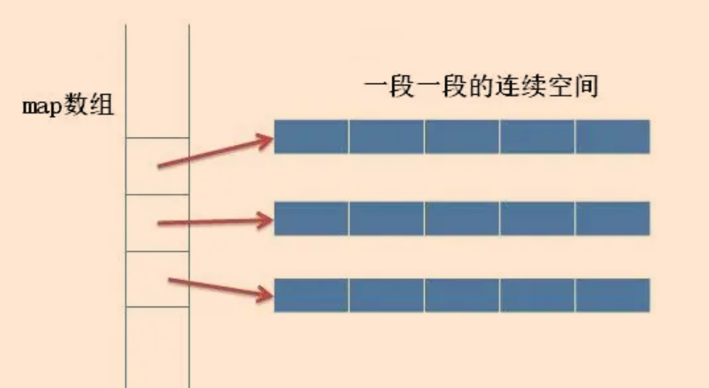
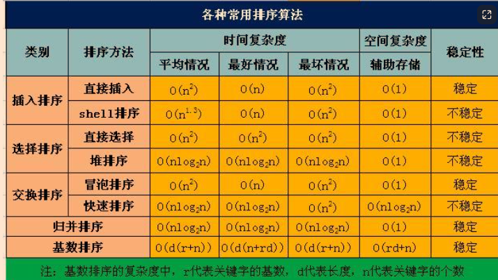
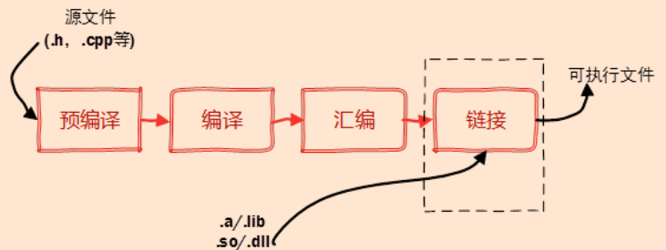
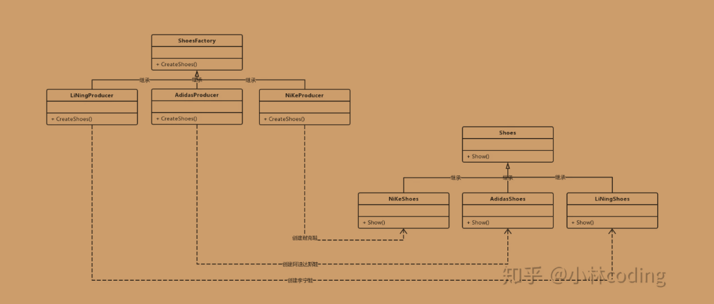
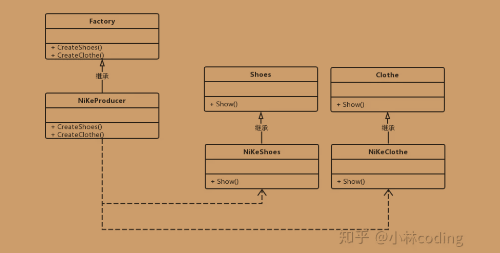
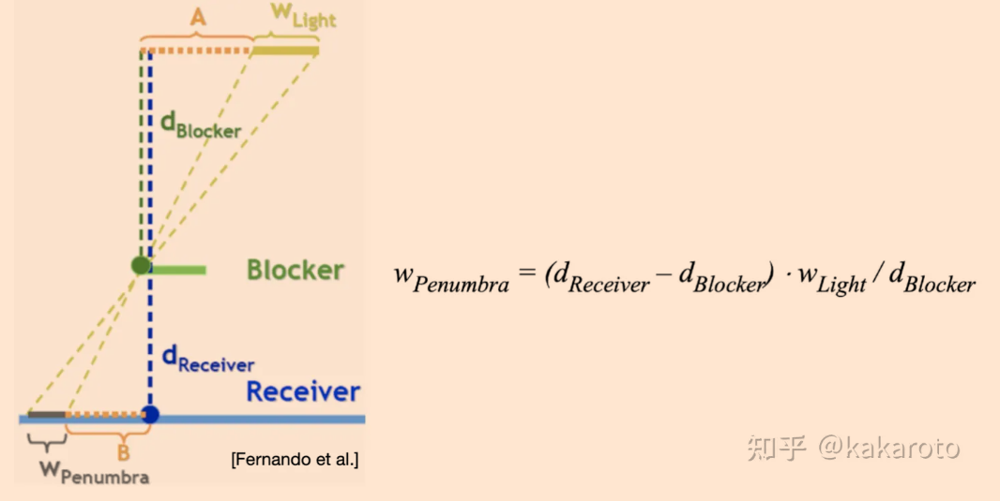
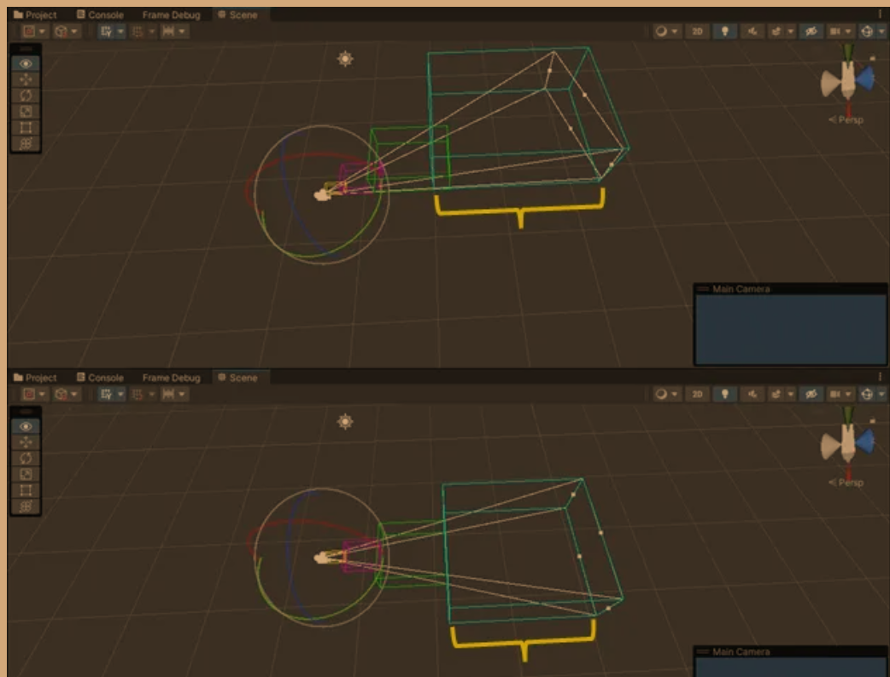
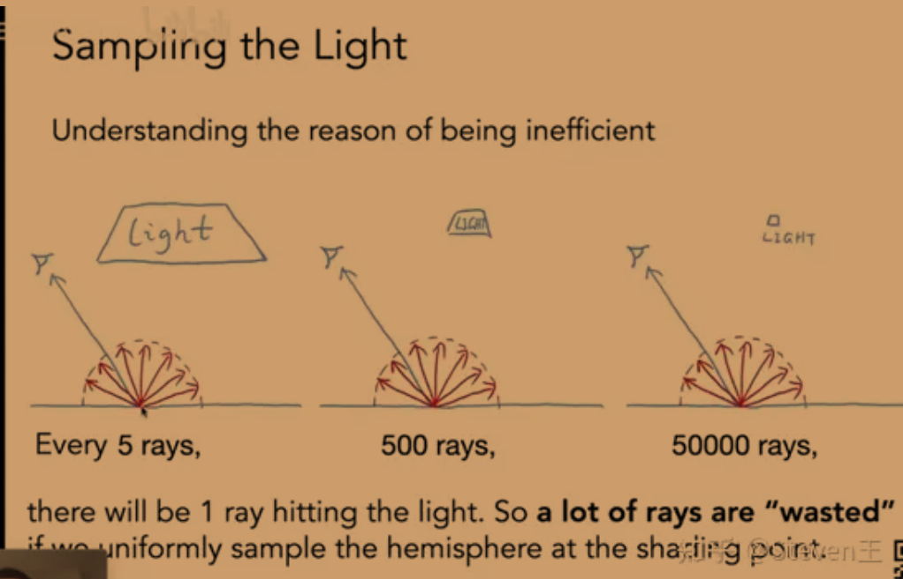
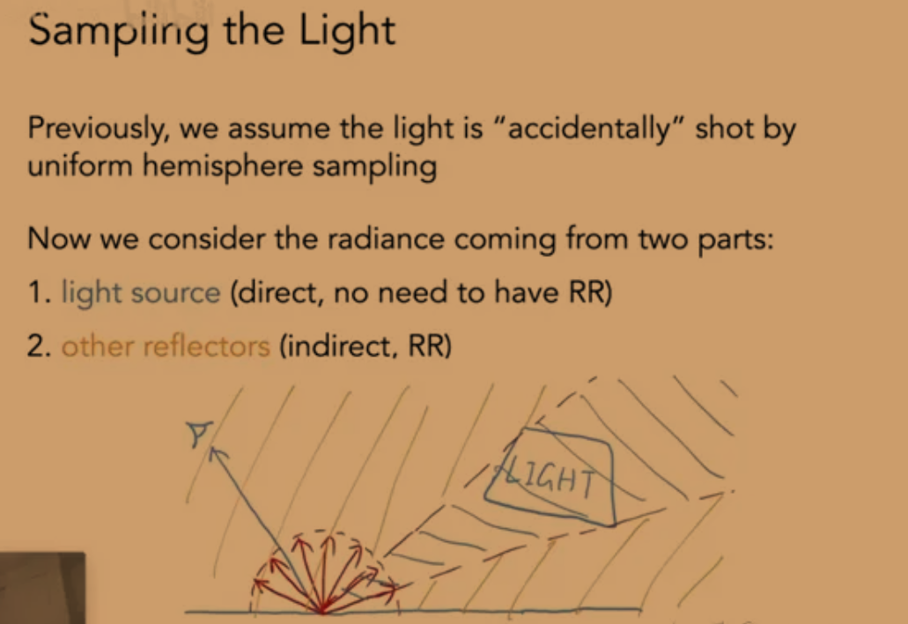
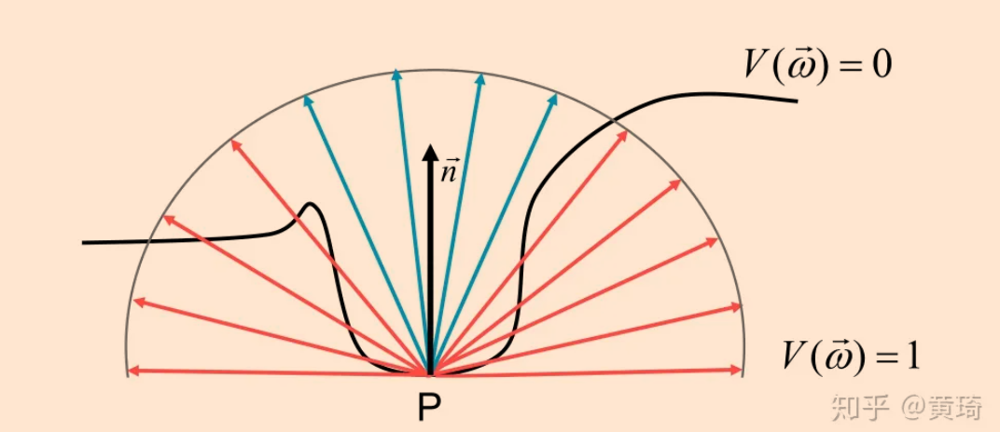

# C++

## 现代C++

### 语言可用性强化

* 引入了nullptr、constexpr、auto、using等
* 在面向对象上，引入了继承构造、委托构造。

### 模板

* **引入了变长参数模板**

* **模板为什么声明和定义不能分离**

C++是分离式编译，编译是对每一个cpp文件而言的，将cpp编译成独立的obj，再将obj进行链接生成exe可执行程序，对于模板而言，模板只有被调用的时候才会被实例化，如果将声明和定义分开放，那么模板函数不会被实例化，就会发生链接错误。

* **类模板和模板类有什么区别**
  * 类模板是一个通用的模板，定义了一个类的框架，其中某些数据成员和方法可以在实例化的时候指定或推断，类模板是一种通用的定义。
  * 模板类是通过实例化而来的具体的类，即在使用时将模板参数替换为实际的类型。

* **函数模板(泛化和特化的问题)，什么是全特化，什么是偏特化**

  * 所谓模板全特化限定死模板实现的具体类型；
  * 偏特化是指提供另一份template定义式，而其本身仍为`templatized`，这是针对于`template`参数更进一步的条件限制所设计出来的一个特化版本。也就是如果这个模板有多个类型，那么**只限定其中的一部分**;

  ```cpp
  //模板全特化
  template<>
  class Test<int,int>
  {
  public:
   Test(int a, int b) :_a(a), _b(b)
   {
    cout << "模板全特化" << endl;
   }
  private:
   int _a;
   int _b;
  };
  
  //模板偏特化
  template<class T>
  class Test<int,T>
  {
  public:
   Test(int a, T b) :_a(a), _b(b)
   {
    cout << "模板偏特化" << endl;
   }
  private:
   int _a;
   T _b;
  };
  ```

  

### 语言运行期强化

* **Lambda表达式**

实际上就是提供了一个类似匿名函数的特性， 而匿名函数则是在需要一个函数，但是又不想费力去命名一个函数的情况下去使用的。这样的场景其实有很多很多， 所以匿名函数几乎是现代编程语言的标配。

* **右值引用**

右值就是右边的值，指的是表达式结束后就不再存在的临时对象。

* **移动语义与完美转发**

传统 C++ 通过拷贝构造函数和赋值操作符为类对象设计了拷贝/复制的概念，但为了实现对资源的移动操作， 调用者必须使用先复制、再析构的方式，浪费时间。

直接通过右值引用，接管将亡值的资源管理，延长生命周期。

完美转发:

```cpp
#include <iostream>
#include <utility>
void reference(int& v) {
    std::cout << "左值引用" << std::endl;
}
void reference(int&& v) {
    std::cout << "右值引用" << std::endl;
}
template <typename T>
void pass(T&& v) {
    std::cout << "              普通传参: ";
    reference(v);
    std::cout << "       std::move 传参: ";
    reference(std::move(v));
    std::cout << "    std::forward 传参: ";
    reference(std::forward<T>(v));
    std::cout << "static_cast<T&&> 传参: ";
    reference(static_cast<T&&>(v));
}
int main() {
    std::cout << "传递右值:" << std::endl;
    pass(1);

    std::cout << "传递左值:" << std::endl;
    int v = 1;
    pass(v);

    return 0;
}
```

### 智能指针与内存管理

智能指针都遵循RAII原理，RAII是对资源申请、释放的操作的一种封装。

#### shared_ptr

* 是一种强引用智能指针，能够记录多少个`shadred_ptr`共同指向一个对象，当引用计数为0的时候对象会自动删除。

```cpp
template<typename T>
class smart
{
private:
	T* _ptr;
	int* _count; //reference couting

public:
	//构造函数
	smart(T* ptr = nullptr) :_ptr(ptr)
	{
		if (_ptr)
		{
			_count = new int(1);
		}
		else
		{
			_count = new int(0);
		}
	}

	//拷贝构造
	smart(const smart& ptr)
	{
		if (this != &ptr)
		{
			this->_ptr = ptr._ptr;
			this->_count = ptr._count;

			(*this->_count)++;
		}
	}

	//重载operator=
	smart& operator=(const smart & ptr)
	{
		if (this->_ptr == ptr._ptr)
		{
			return *this;
		}
		if (this->_ptr)
		{
			(*this->_count)--;
			if (*this->_count == 0)
			{
				delete this->_ptr;
				delete this->_count;
			}
		}
		this->_ptr = ptr._ptr;
		this->_count = ptr._count;
		(*this->_count)++;
		return *this;
	}

	//operator*重载
	T& operator*()
	{
		if (this->_ptr)
		{
			return *(this->_ptr);
		}
	}

	//operator->重载
	T* operator->()
	{
		if (this->_ptr)
		{
			return this->_ptr;
		}
	}

	//析构函数
	~smart()
	{
		(*this->_count)--;
		if (*this->_count == 0)
		{
			delete this->_ptr;
			delete this->_count;
		}
	}
	//return reference couting
	int use_count()
	{
		return *this->_count;
	}
};
```

#### unique_ptr

* 这是一种独占的智能指针，禁止与其他智能指针共享同一个对象。

```cpp
template<typename T>
class UniquePtr
{
public:
	UniquePtr(T *pResource = NULL)
		: m_pResource(pResource)
	{

	}

	~UniquePtr()
	{
		del();
	}

public:
	void reset(T* pResource) // 先释放资源(如果持有), 再持有资源
	{
		del();
		m_pResource = pResource;
	}

	T* release() // 返回资源，资源的释放由调用方处理
	{
		T* pTemp = m_pResource;
		m_pResource = nullptr;
		return pTemp;
	}

	T* get() // 获取资源，调用方应该只使用不释放，否则会两次delete资源
	{
		return m_pResource;
	}

public:
	operator bool() const // 是否持有资源
	{
		return m_pResource != nullptr;
	}

	T& operator * ()
	{
		return *m_pResource;
	}

	T* operator -> ()
	{
		return m_pResource;
	}

private:
	void del()
	{
		if (nullptr == m_pResource) return;
		delete m_pResource;
		m_pResource = nullptr;
	}

private:
	UniquePtr(const UniquePtr &) = delete; // 禁用拷贝构造
	UniquePtr& operator = (const UniquePtr &) = delete; // 禁用拷贝赋值

private:
	T *m_pResource;
};
```

#### weak_ptr

* 是一种弱引用智能指针，不会引起计数的增加，进而解决循环引用问题。

### 多线程

* **thread**


## 关键字

### const

* const用来修饰定义常量，具有不可变性。在类中，被const修饰的成员函数，不能修改类中的数据成员，加mutable关键字后可以修改。
* 指针常量指的是指针是一个常量，不能被修改，但是指针指向的对象可以被修改，常量指针指的是这个指针指向的对象是一个常量，指针本身可以被修改。
* const修饰的函数可以重载。const成员函数既不能改变类内的数据成员，也不能调用非const的成员函数；const对象只能调用const函数，非const对象无论是否为const成员函数都可以调用，但是如果有重载的非const函数，会优先调用非const函数。
* 顶层const：本身是const；底层const：指向的对象是一个const

### static

* static作用：控制变量的存储方式和可见性。
* 作用
  * 修饰局部变量，会将数据放到静态数据区(原本在栈区)，生命周期会延续到程序结束，作用域并不改变。
  * 修饰全局变量，修改了可见性，只有本文件可见
  * 修饰函数，也是改变了作用域
  * 修饰类中的函数与变量，表示由所有对象所有，存储空间只存在一个副本，静态非常量数据成员，只能在类外定义和初始化，在类中只是声明。

### constexpr

告诉编译期，应该是一个常量，方便编译器优化

### volatile

禁止编译器优化


## 内联函数和宏

* **内联函数的作用与缺点**

在编译的时候，将调用内联的地方直接将内联函数的代码块替换，节省了函数调用带来的开销。

* **内联和宏的区别**

  * define是在预处理阶段对命令进行替换，inline是在编译的时候，将调用内联的地方直接将内联函数的代码块替换，节省了函数调用带来的开销。

  * define不会对参数的类型进行检查，会出现类型安全的问题；但是内联函数在编译阶段会进行类型检查；

  * 宏定义时要注意书写（参数要括起来）否则容易出现歧义，内联函数不会产生歧义；

    


## STL

* **STL六大组件和关系**

  容器、迭代器、算法、适配器、空间分配器、仿函式

  

  * 容器：各种数据结构，vector、list、deque、set、map
  * 算法：各种常用算法，包含了初始化、排序、搜索、转换等等
  * 迭代器：用于遍历对象集合的元素，扮演着容器和算法之间的胶合剂，可以视为“泛型指针”。
  * 仿函数：也成为函数对象，行为类似函数，可以作为算法的某种策略。
  * 适配器：一种用来修饰容器或者仿函数活迭代器接口的东西。例如STL提供的queue、stack，就是一种空间配接器。
  * 分配器：空间支配器，负责空间的管理与配置。


### STL各种容器的底层实现

#### **vector**

* 底层是一块具有连续内存的数组，vector核心就在于其长度自动可变，vector的数据结构由三个迭代器实现：指向首元素的start，指向尾元素finish，指向内存末端的end_of_storage。
* 扩容机制：当目前可用的空间不足时，分配目前空间的两倍或者目前空间加上所需的新空间大小，容量的扩张必须经过“重新分配内存、元素拷贝、释放原空间”等。

#### **list**

list底层是一个循环双向链表。

#### **deque**

​		双向队列，**通过建立 map 数组，deque 容器申请的这些分段的连续空间就能实现“整体连续”的效果**。



#### **stack和queue**

栈和队列。基于deque实现，属于容器配接器。

#### **priority_queue**

优先队列，底层为vector容器，以heap作为处理规则，heap是一个完全二叉树。

#### **set和map**

底层都是红黑树实现，红黑树是一种二叉搜索树，平衡二叉树(AVL)和红黑树的区别：AVL 树是高度平衡的，频繁的插入和删除，会引起频繁的rebalance（旋转操作），导致效率下降；红黑树不是高度平衡的，算是一种折中，插入最多两次旋转，删除最多三次旋转。


* **STL内存管理方式，Allocator次级分配器的原理以及内存池的优势和劣势**
  * 为了提升内存管理的效率，减少申请小内存导致的内存碎片的问题，STL采用了两级配置器，当分配空间大小超过128B的时候，会使用第一级空间配置器，直接使用malloc、realloc、free等函数进行内存空间的分配和释放，如果空间分配大小小于128B，将使用第二级空间配置器，采用了内存池技术，通过空闲链表来管理内存。
  * 次级配置器的内存池管理技术：每次配置一大块内存，并维护对应的自由链表(free list)。若下次再有相同大小的内存配置，就直接从自由链表中拔出。如果客户端释还小额区块，就由配置器回收到自由链表中；配置器共要维护16个自由链表，存放在一个数组里，分别管理大小为8-128B不等的内存块。分配空间的时候，首先根据所需空间的大小（调整为8B的倍数）找到对应的自由链表中相应大小的链表，并从链表中拔出第一个可用的区块；回收的时候也是一样的步骤，先找到对应的自由链表，并插到第一个区块的位置。
  * 优势：避免了内存碎片(外部碎片)，不需要频繁从用户态切换到内核态
  * 劣势：仍会造成一定的内存浪费、比如申请120B就必须分配128B（内部碎片）。
* **STL容器的push_back和emplace_back的区别？**
  - 传统C++中，emplace/emplace_back函数使用传递来的参数直接在容器管理的内存空间中构造元素（只调用了构造函数）；push_back会创建一个局部临时对象，并将其压入容器中（可能调用拷贝构造函数或移动构造函数）
  - 现代C++无区别

* **STL的排序用到了哪种算法，具体如何执行？**
  * 快速排序、插入排序和堆排序；当数据量很大的时候用快排，划分区段比较小的时候用插入排序，当划分有导致最坏情况的倾向的时候使用堆排序。
* **排序算法分析**



* **哈希表**
  * 哈希散列可能会存在冲突，解决冲突一般有开放定址法法和拉链法，开放定址法包括线性测探、平方测探法，本质上都是对应位置被占用了就向后查找；
  * 哈希表的长度使用质数，可以降低发生冲突的概率，使哈希后的数据更加均匀，如果使用合数，可能会导致很多数据集中分布到一个点上，造成冲突；

## 工程问题

* 如果一个类有其他的类作为数据成员，构造函数调用顺序是怎么样的？

成员对象的构造函数是在主题构造函数体开始之前调用的，基类的构造函数会在派生类构造函数之前调用。


* **编译链接原理，源文件->可执行文件**

  预处理、编译、汇编、链接

  * 预处理阶段处理头文件包含关系，宏定义，对预编译命令进行替换，生成预编译文件；
  * 编译阶段将预编译文件编译，生成汇编文件（编译的过程就是把预处理完的文件进行一系列的词法分析，语法分析，语义分析及优化后生成相应的汇编代码)；
  * 汇编阶段将汇编文件转换成机器码，生成可重定位目标文件（.obj文件）（汇编器是将汇编代码转变成机器可以执行的命令，每一个汇编语句几乎都对应一条机器指令。汇编相对于编译过程比较简单，根据汇编指令和机器指令的对照表一一翻译即可
  * 链接阶段，将多个目标文件和所需要的库连接成可执行文件（.exe文件）




* **静态库与动态库**

  * 静态库

  静态库链接是在编译器完成，浪费空间和资源，在链接阶段，会与汇编生成的obj文件一起链接生成可执行文件。

  * 动态库

  在程序编译的时候不会链接到目标代码，是在程序运行时才被载入的，因此链接时动态链接。将一些程序升级变得简单。解决了静态库对程序的更新、部署和发布页会带来麻烦。用户只需要更新动态库即可，**增量更新**。


* **如何优化内存**
  * 减少内存泄露。避免使用不必要的局部变量和静态变量，及时释放不再使用的内存空间。
  * 优化内存分配。合理分配内存，避免频繁的申请和释放。
  * 避免内存碎片。使用内存池技术，复用分配好的内存。


### 对象池思想

对于频繁创建和销毁的对象，对象池的思想是，首先从给对象池中寻找有没有可用的对象，如果没有就创建对象来使用，然后当一个对象不使用的时候，不是把它删除，而是将它设置为未激活状态并放在对象池中，等需要使用的时候再去对象池中寻找，并把它激活。


# 设计模式

## 单例模式

保证一个类仅有一个实例，并提供一个访问它的全局访问点，该实例被所有程序模块共享。

* **懒汉单例**

单例实例在第一次被使用时才进行初始化，这叫做延迟初始化。线程不安全，需要加锁，并且不能简单的在前面判空加锁，因为可能某个线程正在初始化单例，另一个线程却在判断单例是否为空，这样就会获取到不完全的单例，造成错误。

* **饿汉单例**

在main函数开始的时候即创建对象，线程安全；

## 工厂模式

- 该模式用来封装和管理类的创建，终极目的是为了解耦，实现创建者和调用者的分离。
- 简单工厂


* 工厂方法



* 抽象工厂



## 观察者模式

* 又叫发布-订阅模式（Publish/Subscribe），定义对象间一种一对多的依赖关系，使得每当一个对象改变状态，则所有依赖于它的对象都会得到通知并自动更新。该模式属于行为型模式。

  

# 图形学

## 渲染管线


* GPU渲染管线有哪些流程

**应用程序-》顶点着色器-》-》几何着色器-》裁剪与消除-》光栅化-》像素着色-》深度模板测试与混合**


* 除了 fs、vs 还有哪些着色器？它们的作用？写代码时用过哪些着色器？

1. 几何着色器，用于处理几何图形，通常在顶点着色器喝片元着色器之间执行，用于生成新的几何图形、增加几何细节、执行投影和裁等等
2. 细分着色器是用于曲面细分的一对着色器。TCS（细分控制着色器）用于控制如何细分曲面，而TES（细分评估着色器）用于计算细分曲面的最终顶点坐标。
3. 计算着色器，可以执行通用计算任务，而不涉及图像渲染，通常用于GPGPU任务，数据处理以及物理模拟等等。

* **GPU与CPU的区别**

  * CPU存在性能限制，而GPU不存在，我们可以吃掉GPU的所有运算资源，而不能吃掉所有CPU的运算资源，否则会导致系统崩溃
  * CPU性能再高，是以高并发的形式调度的，尽管现在有4核、8核，但始终不够自由，而GPU实现了真正的并行，GPU有很多小的运算单元，可以同时完成简单的运算。
    * 如果一个计算内核做的很小，但是做很多个，那么我们就可以同时在这些核上做同样的运算，基于SIMD模型，这就是GPU算力强的原因。

* **什么是DrawCall**

  * 在应用阶段，尽管CPU把数据准备得十分充分，在完成传送任务后，CPU也不能一走了之，还需要向GPU下达一个渲染命令，这个命令就是Draw Call，由于之前我们把这个数据准备得十分完善了，所以DrawCall仅仅是一个指向被渲染的图元列表，没有其他材质信息。
  * CPU向GPU发送指令也是像流水线一样，CPU王命令缓冲区中一个个放入命令，GPU一个个取出，在实际的渲染中，GPU的渲染速度往往超过了CPU的提交命令的速度，这就导致大部分时间都消耗在了CPU的Draw Call上，有一种解决办法是**批处理**，即要把渲染的模型合并在一起交给GPU。

  

* **各种测试的含义以及相对顺序**

  * 裁剪测试，在裁剪测试中，允许程序员开设一个裁剪框，只有在裁剪框内的片元才会被显示出来，在外部的偏远均被剔除，通常情况下，我们会让视口的大小和屏幕空间一样大，此时可以不需要使用到裁切测试。但当两者大小不一样大时，我们需要用到裁切测试来避免其产生的一些问题。如下图所示。

  

  * Alpha测试：像素值一般是由RGBA四个分量来表示的，其中的A是alpha，表示的是物体的不透明度。1代表完全不透明，0代表完全透明。可选的 alpha 测试可在深度测试执行前在传入片段上运行。片段的 alpha 值与参考值作某些特定的测试（如等于，大于等），如果片段未能通过测试，它将不再进行进一步的处理。 alpha 测试经常用于不影响深度缓存的全透明片段的处理。简单来说，就是根据物体的透明度来决定是否渲染。
  * 模板测试：模板缓冲是用于记录所呈现图元位置的离屏缓存，如下图所示，如果使用了模板缓冲，就相当于在屏幕上有一块模板盖在上面，只有位于这个模板中的图元片段，才会被渲染出来。模板测试就是用片段指定的参考值与模板缓冲中的模板值进行比较，如果达到预设的比较结果，模板测试就通过了，然后用这个参考值更新模板缓冲中的模板值；如果没有达到预设的比较结果，就是没有通过测试，就不更新模板缓冲。简单来说，就是根据物体的位置范围决定是否渲染。


* 

* * 深度测试： 我们在观察物体的时候，位于前面的物体会把后面的物体挡住，所以在渲染的时候，图形管线会先对每一个位置的像素存储一个深度值，称为深度缓冲，代表了该像素点在3D世界中离相机最近物体的深度值。于是在计算每一个物体的像素值的时候，都会将它的深度值和缓冲器当中的深度值进行比较，如果这个深度值小于缓冲器中的深度值，就更新深度缓冲和颜色缓冲的值，否则就丢弃（深度测试和深度写入）；简单来说，就是根据物体的深度决定是否渲染。

* * 测试顺序:裁剪测试-》alpha测试-》模板测试-》深度测试

  

* **深度测试在哪个阶段？Early-Z呢，存在什么问题？**

  * 深度测试在frag shader后面，处于可控制渲染流水线的最后一步，也就是说是所有像素处理完毕之后再进行深度测试，这就会造成比如说两个重叠的物体重复部分的像素重复计算，以及对物体背面的不必要计算等，物体一多就会很消耗性能
  * Early-Z是一种提前深度测试的技术，它位于光栅化阶段之后，像素处理阶段之前，目的是减少进入像素着色阶段的片段，优化性能。Early-Z会带来透明测试的冲突,Early-z是从前往后计算渲染的，因此如果有透明或者半透明物体位于不透明物体前面，他只会写入半透明物体的深度，从而跳过后面不透明物体像素的计算，但是实际情况下，我们透过透明/半透明物体是看得到后面的不透明物体的，这就产生了冲突。

* **延迟渲染的优缺是什么？在移动端需要考虑什么问题**

优点：

	1. 支持大量光源。延迟渲染可以支持大量官员，他仅需要对场景的几何信息进行一次渲染，然后为每个光源执行光照计算，而不必对每个光源进行完整的渲染。
	1. 灵活性，延迟渲染允许多个光照和材质通道，以实现复杂的光照效果。
	1. 后期处理，延迟渲染可以方便的进行后期处理，如SSAO等。

缺点：

1. gbuffer显存占用比较大，存储的信息比较多，几何、法线、深度、材质等等。
2. 透明物体问题，延迟渲染不适用于大量半透明物体，因为它难以正确处理半透明物体的混合效果。
3. 硬件要求，需要叫高性能的GPU

在移动端，主要需要考虑：

1. **性能考虑**：移动设备的GPU性能有限，因此需要仔细优化渲染管线，以确保渲染保持流畅。
2. **内存管理**：移动设备的内存有限，需要小心管理渲染缓冲区，以避免内存泄漏和性能问题。
3. **适应硬件**：不同移动设备的GPU性能和特性不同，需要为不同的设备进行适配。
4. **移动设备特性**：移动设备通常具有触摸屏、加速计、陀螺仪等特性，可以在游戏中进行互动和控制，需要考虑如何集成这些特性。
5. **电池寿命**：在移动设备上，渲染过程对电池寿命有影响，需要优化以减少能耗。

在移动端可以将多个 gbuffer 压缩成一张纹理，苹果的 metal 有实现移动端 gbuffer 的优化，通过 Lossy compression 压缩 Render Target 的大小以节省显存带宽


* **Gamma 校正，何时切换到gamma空间**

显示器电压和亮度的变换不是线性的，而是 gamma 2.2

在线性空间计算光照、颜色，输出的时候要做一次 gamma 0.454 抵消显示器的变换


* **顶端属性太多，槽位不够怎么办**

1. 合并顶点属性，将多个的相关的顶端属性合并成一个顶点属性

## 辐射度量学

### 基础名词

* 辐射能(Radiant energy)Q：电磁辐射的能量，单位是$J$


* 辐射通量(Radiant flux)或功率(power)$\phi$:单位时间释放、反射、投射、或者接受的能量。单位是$W$或者$lm$


* 辐射强度(Radiant Intensity):辐射强度是单位立体角(solid angle)由点光源发出的功率（power）。


各向同性点源：


* 辐照度(Irradiance)

辐照度就是每(垂直投影)单位面积入射到一个表面上一点的辐射通量。


兰伯特余弦定律：**表面辐照度**与**光方向和表面法线夹角的余弦值**成**正比**(也就是说只要在表面法线方向的的辐射度分量)。


* 辐射(Radiance)：是指一个表面在**每单位立体角、每单位投影面积**上所发射(emitted)、反射(reflected)、透射(transmitted)或接收(received)的**辐射通量(功率)**。


**辐射强度(Radiant Intensity)、辐照度(Irradiance)、辐射(Radiance)三者关系：**

辐射强度：单位立体角的辐射通量

辐照度：单位投影面积的辐射通量

辐射：**单位投影面积**的**辐射强度**或者是**单位立体角**的**辐照度**(单位立体角、单位投影面积的辐射通量)

**入射辐射**(Incident Radiance)：指**到达表面的单位立体角**的**辐照度**。即它是沿着给定光线到达表面的光(入射方向指向表面)


**出射辐射**(Exiting Radiance)：**离开表面**的**单位投影面积**的**辐射强度**。例如：对于面光(area light)，它是沿着给定光线发射的光(出射方向指向表面)


## **辐照度**(Irradiance) **VS. 辐射**(Radiance)

辐照度：在面积$dA$ 的总辐射通量

辐射： 在面积$dA$ 、方向$dw$ 上的辐射通量


### PBR

* **谈一下BRDF中，D、F、G项？菲涅尔项会带来什么样的视觉效果？**

1. D：表示的是微表面结构中法线分布函数，它描述了光线以多大的概率在不同方向上的散射。
2. F：菲涅尔项目，表示的是光线在材质表面与介质之间的反射和折射的行为，掠视金属时反射较多的光而俯视时反射光较少
3. G：表示的是几何遮蔽的情况，通过史密斯法叠加入射和出射两个方向


* **PBR 材质贴图很多，纹理槽位不够应该怎么处理？**

1. 合并多个属性到一个通道，比如将roughness和metallic可以存在8bit纹理的高低4bit上
2. 虚拟纹理，将小贴图合并成大贴图，按需调入


* **PBR贴图格式需要注意什么？**

1. **颜色空间**：确保在加载贴图时使用正确的颜色空间。漫反射和环境反射贴图通常使用sRGB颜色空间，而法线贴图和金属度贴图通常使用线性颜色空间。


## 渲染

* **GPU 渲染一般都是以Tile为基本单元的，为什么？**

[Tile-Based Rendering学习笔记 - 知乎 (zhihu.com)](https://zhuanlan.zhihu.com/p/393712805)

所谓Tile，就是将几何数据转换成小矩形区域的过程。光栅化和片段处理在每Tile的过程中进行。Tile-Based Rendering的目的是在最大限度地减少fragment shading期间GPU 需要的外部内存访问量,从而来节省内存带宽。TBR将屏幕分成小块，并在将每个小图块写入内存之前对每个小图块进行片段着色。为了实现这一点，GPU 必须预先知道哪些几何体属于这个tile.因此，TBR将每个渲染通道拆分为两个处理通道：

提高渲染效率和性能。

1. **并行处理：** 瓦片化允许GPU并行处理多个小区域。每个瓦片可以独立处理，这意味着不同的处理单元（如CUDA核心）可以同时处理不同的瓦片，从而加速整个光栅化过程。这种并行处理方式充分利用了GPU的强大并行计算能力。
2. **局部性优势：** 瓦片化可以提高空间局部性，因为相邻像素通常会在相邻的瓦片中处理。这意味着在进行纹理采样、深度测试等操作时，可以更好地利用缓存，减少对全局内存的访问，从而提高数据访问效率。
3. **减少带宽需求：** 将屏幕分成小块，减少了在光栅化阶段需要处理的像素数量，从而减少了内存带宽的需求。这对于高分辨率屏幕和复杂场景来说尤为重要，因为在渲染时需要处理的像素数量可能会非常庞大。‘
4. **偏导计算：**在瓦片内部完成偏导计算，获取梯度信息。

* **从深度图如何还原法线？**

[【知识补充】深度信息还原位置和法线 - 知乎 (zhihu.com)](https://zhuanlan.zhihu.com/p/367257314#:~:text=在了解如何用深度,即可，伪代码如下)

如何在一个三角形面片中求法线？ **叉乘嘛！**

在对应空间(世界、视角等)找出来近似的面片，叉乘！！！

一个很大的应用情景是在后处理的阶段，或是计算一些屏幕空间的效果（如SSR、SSAO等），只能获取到一张深度贴图，而不是每一个几何体的顶点数据，很多的计算中却又需要用到世界空间的法线或者是视空间的法线，这时我们就需要通过深度图来重建视空间的法线。

```glsl
vec3 P  = GetViewPos(v2f_TexCoords);
vec3 Pl = GetViewPos(v2f_TexCoords + vec2(-xOffset,0));
vec3 Pr = GetViewPos(v2f_TexCoords + vec2(xOffset,0));
vec3 Pu = GetViewPos(v2f_TexCoords + vec2(0,yOffset));
vec3 Pd = GetViewPos(v2f_TexCoords + vec2(0,-yOffset));
vec3 leftDir = min(P - Pl, Pr - P) ? P - Pl : Pr - P//求出最小的变换量
vec3 upDir   = min(P - Pd, Pu - P) ? P - Pd : Pu - P//求出最小的变换量
vec3 normal = normalize(cross(leftDir,upDir))
```

* **如何解决因为顶点过近和浮点数的精度不足带来的穿模问题**
  * 增加深度缓冲的精度值。
  * 开启深度偏移。渲染物体前，可以通过一定量的偏移来调整深度值。
  * 调整相机的远近裁剪面。
  * 几何着色器可以在顶点和片元处理之间执行操作，可以在此处进行一些深度值的处理，以缓解穿模问题。

## 纹理

* **纹理采样模式**
  * Warp(重复寻址)。最常见的模式，四方连续贴图可以无限延伸用的就是这种算法，即超过1之后重复0到1。
  * Clamp(钳位寻址)。最边缘像素拉伸的效果。
  * Border(边框寻址)。坐标越界后，返回的颜色为给定的颜色值。
  * Mirror(镜像寻址)，类似于重复，只不过是镜像重复效果。

## 光照模型

### 局部光照模型


在真实感图形学中，进处理光源直接照射物体表面的光照模型被称为局部光照模型。

* **Lambert漫反射模型**

  特点：

  * 反射强度和观察者角度没关系
  * 反射强度和光线的入射强度有关系

Lambert是光源照射到物体表面后，向四面八方反射，产生的漫反射效果，这是一种理想的漫反射光照模型。 

```cpp
half3 FinalColor;
FinalColor=Kd*dot(Normal,LightDir);//实现Lambert光照模型
FinalColor*=BaseColor;//叠加模型基础颜色
return FinalColor;
```

* **phong模型**

Phong模型由三种反射光组成，反别是漫反射光，环境光，镜面反射光。

Phong模型会有一个问题，在镜面反射会在一些情况下出现问题，特别是物体反光度低的时候，会导致大片的高光区域，会出现断层的情况，这是因为观察向量和反射向量之间的夹角不能大于90°，如果点积为负数，镜面光分量会变成0.0，


* **Blin-phong模型**

Blin-Phong模型在计算高光的时候，选择用半程向量与法线的夹角来代替反射向量和视角的夹角，这样就解决了上面的问题。

* **cook-torrance**

Cook-Torrance模型兼顾漫反射和镜面反射两个部分。


这里的 $k_d$是早先提到过的入射光线中**被折射**部分的能量所占的比率，而 $k_s$ 是**被反射**部分的比率。BRDF的左侧表示的是漫反射部分，这里用 $f_{lambert}$来表示。它被称为Lambertian漫反射。
$$
f_{lambert} = \frac{c} {\pi}
$$
BRDF镜面反射公式
$$
f_{cook-torrance} = \frac{DFG}{4(w_0 ·n)(w_i ·n)}
$$
D：法线分布函数：描述的是各个为表面法线的集中程度。

F：菲涅尔项，跟观察方向和法线方向有关，当从掠射角观察时没看到的反射现象就越明显

G：几何自遮挡项，考虑的是微表面之间的相互作用，当一个平面相对比较粗糙的时候，平面表面上的微平面有可能挡住其他的微平面从而减少表面所反射的光线。


### **全局光照模型**

* **光线追踪**

光线追踪算法通过模拟光的传播方式，即光从光源出发经过若干次反射、折射到达摄像机的过程来实现全局光照的效果。

1. whitted光线追踪

可实现直接光照、镜面反射和折射效果。从摄像机出发发射光纤，打到世界空间最近的物体，找到着色点，着色点向光源发射一条阴影线以寻找焦点，如果交点存在，则意味着物体被挡住了，该着色点处于阴影之中，否则，着色点可以被直接光源照亮。为了实现镜面的反射和折射的效果，当光源命中了一个镜面材质的物体的时候，继续反射或者折射出新的光线，如此递归下去。


2. path tracing

whitted style ray tracing问题很明显，在打到漫反射物体的时候会停止，显然不应该停止，而是随即发射一条光线，基于蒙特卡洛法，在半球上做随机的采样，一般会做重要性采样，引入权重，递归终止条件可以采用俄罗斯轮盘赌的方法，为了提高采样的质量，可以利用积分变换从光源出发发射光线。

```cpp
float shade(vec3 p, vec3 wo)
{
    //直接光部分
    vec3 q = random() by pdf_light;//光源上随机采样一个q点
    vec3 wi = normalize (q - p);
    float l_dir = 0.0;
    ray r2light = ray(p, wi);
    if(r2light hit light at q)//没有障碍物
        l_dir = fr(p, wi, wo) * li * dot(n, wi) * dot(n', wi) / pdf_light(q) / len(q-p)^2;
    
    //间接光部分
    float l_indir = 0.0;
    float prob = 0.6;
    float num = random(0,1);
    if(num < prob)
    {
        vec3 wi = random() by pdf;
        ray r = ray(p, wi);
        // object不能是光源，如果r打在了光源上则忽略。
        if(r hit object at o)
            l_indir = fr(p, wi, wo) * shade(o, -wi) * dot(n, wi) / pdf(wi) / prob;
    }
    return l_dir + l_indir;
}
```

## 抗锯齿处理

### 锯齿产生原因

屏幕是由一系列离散的点组成，光栅化的时候，是以像素中心点是否被三角形覆盖来决定是否生成片段，就产生了锯齿。

### SSAA(超采样抗锯齿)

先映射到高分辨率缓存中，然后对每个像素图像像素采样，一般取临近2-4个像素，采样混合后，生成最终的像素再缩小到原来图像一样的大小。

加入屏幕分辨率为 M*N，超采样次数为k，每个像素都会进行k次着色

### MSAA(多重采样抗锯齿)

MSAA运行在光栅化阶段，会计算一个覆盖率，在片段着色阶段，每个像素仍然只运行1次着色，只是最后的结果会乘上覆盖率。

缺点：MSAA不支持延迟渲染，MSAA本质上是发生在光栅化阶段的技术，需要用到场景的几何信息，延迟渲染着色计算的时候已经丢失了该信息，如果强行这么处理，MSAA会增加数倍的带宽，也是一个非常严峻的问题，

* MSAA一个点在三角形内部就最后相乘的覆盖率就是100吗？

**还要考虑深度缓冲。**

### FXAA(近似快速抗锯齿)

FXAA是MSAA一种高性能近似，位于后处理阶段实现，不依赖于硬件，总体思想：

1. 找出来图像中的所有边缘(通过亮度比较，G分量)
2. 平滑化边缘(沿着某一个方向将一定范围的像素取出来求加权平均)

### TAA(时域抗锯齿)

从时间维度上进行抗锯齿处理，使用同个像素在不同帧上的不同采样点，根据时间先后进行一个加权平均计算；但是TAA也有缺点，就是容易出现鬼影和抖动的现象；

## 阴影技术

对于静态的物体可以采用LightMap烘焙的方法来获取物体的影子，而对于动态物体，一般采用的是shadowmap技术。

### LightMap(光照贴图)

（1）原理：从光源的方向去烘培(离线渲染)一个物体，把结果存一张贴图里，因为离线渲染的时候，如果光线和物体之间有东西被遮挡，那么物体上该点处就会存在阴影，那么在Lightmap上就是一个阴影的值(较暗的像素)**，**然后渲染的时候直接对该物体从光照贴图里面采样即可，

（2）缺点：Lightmap只能存diffuse分量，不能存specular分量，没办法做动态阴影。

### ShadowMap(阴影贴图)

从光源渲染一遍场景，将深度信息存到深度图中，在正常渲染一次场景，利用shadowmap来判断那些片段落入了阴影中。

* 常见问题

  * 抖动(自遮挡)

  可以通过偏移来解决，增加一个bias来比较片段深度，还有一种更好的方式是自适应偏移，基于斜率去计算当前深度要加的偏移。

  * 锯齿

  可以使用百分比渐进过滤(Percentage Closer Filter，PCF)技术进行解决：从深度贴图中多次采样，每次采样坐标都稍有些不同，比如上下左右各取9个点进行采样（即一个九宫格），最后加权平均处理，就可以得到柔和的阴影。标准PCF算法采样点的位置比较规则，最后呈现的阴影还是会看出一块一块的Pattern（图块），可以采用一些随机的样本位置，比如Poisson Disk来改善PCF的效果

### PCSS（Percentage-Closer Soft Shadows）

PCF filter的半径是固定的，但是根据自然现象来看，遮挡物和阴影距离越近，阴影应该越硬


根据这样的现象，PCSS通过相似三角形原理，动态计算出PCF应该采样的范围大小：




### CSM(Cascade ShadowMap，级联阴影贴图)

CSM根据对象到观察者的距离距离提供不同分辨率的深度纹理来解决上述问题。CSM将相机的谁锥体分割成了若干部分，然后为分割的每一个部分生成独立的深度贴图。

CSM通常用于大型场景模拟太阳的投射，对于**近处**的场景使用**较高分辨率**的**阴影贴图**，对于**远处**的场景使用**粗糙**的**阴影贴图**。

首先要生成CSM：

1.对视锥体进行划分


2. 每一个子视锥体都是一个场景，所以我们每一级Shadow map都要至少覆盖整个视锥体，阴影相机通常使用正交投影，正交投影的视野范围是长方体故不难想到通过 AABB 盒子来包围：


3. 生成深度图，有了视锥划分的box之后，我们还需要设置阴影相机以生成深度贴图，阴影相机的正交范围和包围盒保持一致。

采样思路如下：

1. 使用每个光源的**光椎体**渲染**场景**的**深度值**。
2. 从相机位置渲染场景。根据**片段**的**z值**，选择**合适**的**阴影贴图**查询片段对应的**阴影贴图**中的**深度数据**，将其和**片段**在**光椎体**下的**深度值**进行比较，根据比较结果决定**片段**的**最终颜色**。

CSM明显存在抖动问题：

* 相机的平移抖动，在移动的时候，对场景的同一个三角形采样出来的深度图不一样，我们可以通过控制每次偏移的距离来解决这个问题，保证每次偏移都是深度图 空间长度/resolution的整数倍

```c#
// 计算 Box 中点, 宽高比
Vector3 center = (box[3] + box[4]) / 2;
float w = Vector3.Magnitude(box[0] - box[4]);
float h = Vector3.Magnitude(box[0] - box[2]);
//float len = Mathf.Max(h, w);
float len = Vector3.Magnitude(f_far[2] - f_near[0]);
float disPerPix = len / resolution;

Matrix4x4 toShadowViewInv = Matrix4x4.LookAt(Vector3.zero, lightDir, Vector3.up);
Matrix4x4 toShadowView = toShadowViewInv.inverse;

// 相机坐标旋转到光源坐标系下取整
center = matTransform(toShadowView, center, 1.0f);
for (int i = 0; i < 3; i++)
    center[i] = Mathf.Floor(center[i] / disPerPix) * disPerPix;
center = matTransform(toShadowViewInv, center, 1.0f);
```

* 相机的旋转抖动

在旋转的时候相机的包围盒长宽时刻在变化，单张阴影贴图能覆盖的面积也不断变换，自然造成了生成图像的走样：




因为我们的包围盒设定上就是要严密包围视锥体，所以对旋转变换比较敏感。可以粗暴的将主相机子视锥体（梯形台）的长对角线作为包围盒的宽高，因为只要主相机参数和 CSM 划分参数不变那么长对角线就不会变，况且包围盒最长不会超过长对角线。

这样一来能够保证正交投影视锥体的宽高和主相机旋转无关。这么做虽然损失一些阴影贴图的精度但仍是合理的交换，况且低精度的 Shadow Map 我们有各种 trick 来料理它。再次修改 CSM.ConfigCameraToShadowSpace 函数，首先取得当前 level 的子视锥体（梯形台）然后计算长对角线。

## 延迟渲染

（1）延迟渲染要将物体的几何信息(位置、法线、颜色、镜面值)存到集合缓冲区中(G-Buffer)，在光照处理阶段，使用G-Buffer中的纹理数据，对每个片段进行光照计算，这种渲染方法的一个好处就是能保证在G-Buffer中的片段和屏幕上呈现的像素所包含的片段信息是一致的，因为深度测试已经最终将这里的片段信息作为最顶层的片段。这样保证了在光照处理阶段，每个像素只处理一次，延迟渲染思想：先深度测试，再着色计算，将本来在物体空间(三维空间)进行的光照计算放到了屏幕空间(二维空间)处理计算。

（2）在每一帧当中G-buffer存储的信息有：位置、法线、颜色值、镜面值（所以其实有三张纹理，分别存位置、法线和颜色+镜面值(RGB+)A)；如果是PBR，应该还要再存一个金属度和粗糙度贴图。

## **GI**

### PRTGI

PRT思想：将光照切割成Lighting, Light Transport两部分。

### RSM(Reflective shadow map)

1.考虑一次间接反射，需要先知道二级光源，即直接光照可以照亮的地方，什么信息可以告诉我们这一点呢？Shadow Map可以，存储了从光源看过去最远的点。


在此，还有一个假设，被直接光照照亮的物体反射都是diffuse的，这样radiance比较好求。这里是假设reflector，没有要求receiver也是diffuse。

2. 考虑哪些次级光源会对着色点p产生贡献。

考虑所有surface patch的贡献，进行求和；并且每个surface patch可以看成是一个area light。

我们之前说过每一个小的patch都可能对照亮p点做出贡献,因此我们可以先计算出一个patch做出的贡献,之后用求和的形式将所有patch的贡献加在一起.


我们可以看到q是一个patch去照亮点P

q其实就是RSM中一个Texel所对应的patch,在games101中我们说过,原本计算q对p点的贡献,我们应该是对整个立体角进行采样,但是这样的话很浪费很多的sample,为何不直接在light处采样然后去计算p点的shading值呢.


也就是把立体角的积分变成了对light区域面积的积分,如果当区域足够小的时候dA甚至不用积分，直接相乘后相加就行,现在我们要解的是patch在接受直接光照后反射出的radiance是多少,也就是从q点到p点的radiance,那么如何解呢?


对于每个次级光源点来说,由于我们假设它的brdf是diffuse的,因此次级光源的fr积分后是个常数,此时我们把Li代入到式子中会发现dA刚好会被抵消.之后式子会少去dA,会多出来一个$\phi_p$，然后$\phi_p$和 $\frac{cos\theta_q cos\theta_p}{||p-q||^2}$ 又组成了下列公式中的Ep与剩余部分结合求出了一个次级光源p对着色点所得到的shading结果,再将积分域中所有的结果加在一起,就是着色点最后被间接光照照亮所得到的shading值.


公式求的是次级光源的光线贡献在着色点上的Irradiance,Ep表示次级光源对着色点贡献的入射irradiance.


还有什么问题嘛？

首先关于可见性，次级光源到着色点是否可见呢？需要为每个次级光源算一个shadow map，这显然不太可能！难办，那就别办了。


显然，不是所有的pixels都会产生贡献，可见性、朝向、距离都是影响因素。

- -Visibility（仍然非常难算）；
- -方向：比如X-1点在SM中记录的是桌子的表面，而且这个表面的点法线方向是朝上的，因此根本不可能照亮X点；
- -距离：因为远处的次级光源贡献很少，通常只要找距离足够近的次级光源就行了。

因此为了加速这一过程,我们认为在shadow map中着色点$x$的位置和间接光源$x_p$的距离可以近似为它们在世界空间中的距离。所以我们认为，对着色点$x$影响大的间接光源在shadow map中一定也是接近的。

于是我们决定先获取着色点$x$在shadow map中的投影位置(s,t)，在该位置附近采样间接光源，多选取一点离着色点近的VPL，并且为了弥补越往外采样数越少可能会带来的问题，引入了权重，越近了权重越小，越远的权重越大。那么对于一个shading point差不多找400个次级光源来计算是比较合适的。如下图所示。


现在ShadowMap上存储的东西就比较多了，深度值、世界坐标、法线、flux


优点：容易实现。

缺点：性能会随着直接光源的数量的增加而降低（光源越多，shadow map越多，次级光源越多）

​			没有做可见性检查，并且假设反射物是diffuse的

​			需要在质量和采样率上做一个平衡（采样多，性能低，质量高；采样少，性能高，质量垃；典型trade off）

### LPV(Light Propagation Volumes)

核心思想：在3D空间中传播光线，从而利用它做出间接光照而实现了GI

LPV特点：

1. fast
2. Good quality

问题：如果我们能获得从任何一个shading point上来自四周的radiance的话们就可以立刻得到间接光照。

核心思路：我们家杀光在传播的过程中，radiance是uniform的（intensity 平方衰减）

解法：将场景划分为若干个3D网络，每一个网络叫做Voxel，在计算直接光照后，将接收到直接光照的表面看作间接光照在场景中的传播点。


步骤：

1. 找出接收直接光照的点。
2. 把这些点注入到3D网络中作为间接光照的传播起点。
3. 在3D网络中传播radiance
4. 传播完成后，渲染场景

具体步骤：

* **生成**

  

  * 首先通过Shadow Map找出接受直接光照的物体表面
  * 对得到的光源数量可以通过采样一些进行简化进而降低次级光源的数量，最后获得一系列的虚拟光源

* **注入**

  

  * 预先将场景划分为3D网格
  * 将虚拟光源注入到对应的格子中
  * 一个格子内可能含有多个不同朝向的虚拟光源，把各自内所有虚拟光源不同朝向的radiance算出来并sum求和，从而得到一个往四面八方发射的radiance
  * 由于是在空间上的分布，可以看作球面函数，用SH(球谐函数)表示（工业界一般用两阶SH就可以表示各个方向上的radiance初值）

  

* **传播**

  

  * 由于是3D网络，因此可以向六个面传播(上下、前后、左右)，由于radiance是沿着直线传播，我们认为radiance是从网格中心往不同方向进行传播的，穿过哪个表面就往哪个方向传播比如穿过右表面的radiance,就传播到右边的格子里(不考虑斜角,比如右上方向,我们认为是先到右边格子,再到上面格子)
  * 每个格子计算收到的radiance,并用SH表示
  * 迭代四五次之后,场景中各voxel的radiance趋于稳定

* **渲染**

  - 对于任意的shading point，找到他所在的网格

  - 获得所在网格中所有方向的Radicae；

  - 渲染

* **问题**

  * 漏光

  由于我们认为radiance是从格子正中心向四周发散的,当遇到这种情况时,

  

  按理说点P反射的radiance是无法照亮墙壁的背后,但是由于我们的假设,会导致墙壁后面也被间接光照照亮,也就是所谓的漏光现象.

  

如图,你看房屋的下部本不应该被照亮,但由于使用了LPV导致了light leaking现象.

我们是可以解决漏光现象的,那样需要我们划分的格子足够小,这样会导致存储量增多,而且传播过程中传播的格子量增多,也就导致了速度慢.

对于两个格子之间的可见性也进行了假设，假设相邻格子都能看见，同时工业界会用不同大小的格子 也就是**Cascade层级加速结构**，来优化LPV的方法。


### VXGI(Voxel Global IIIumination)

VXGI也是一个2-pass算法，但是与RSM有一些区别。

* **区别1：次级光源从RSM中的pixel→VXGI中的Voxel（格子）**

RSM 中次级光源是像素中所包含的微小表面，这些表面是根据Shadow Map来划分的.

VXGI把场景完全离散化成了一系列微小的格子，可以理解为场景是由一堆乐高堆起来的,如图,这些是最细的层级,也就是最小的格子我们可以在这一层基础上去建立一层大点的格子,依此类推从而根据场景的不同划分建立出一个Hierachical树形结构的体素。


* **区别2：光线从传播变为了追踪**

在LPV中,我们将受到直接光照的点注入到场景划分的Voxel之后进行传播,只需要传播一次就可以知道场景中任何一个shading point收到间接光照的radiance.

而在VXGI中第二趟我们从camera出发,就像有一个Camera Ray打到每一个pixel上,根据pixel上代表的物体材质做出不同的操作,如果是glossy则打出一个锥形区域,diffuse则打出若干个锥形区域,打出的锥形区域与场景中一些已经存在的voxel相交,这些voxel对于Shading point的贡献可以算出来,也就是我们要对每一个shading point都做一个cone tracing


* **具体步骤**

  * **Pass1：Light Pass**

  首先找出来那些Voxel会被照亮，那么我们要从接收到直接光照的patch开始，不管是RSM还是什么，先找出来受直接光照影响的patch。

  但是场景现在是由voxel表示的，那么对于任何一个格子，跟LPV注入很像，这里不再记录表面的出射分布或者说认为表面是diffuse的半球分布，也就是不再像LPV一样将所有的radiance加在一起求一个各方向的初始值。

  

  记录的是直接光源从哪些范围来（绿色部分），记录各个反射表面的法线（橙色部分），通过**输入方向**和**法线范围**两个信息然后通过表面的材质，来准确的算出出射的分布，这样就比LPV认为格子表面是diffuse再用SH来压缩的方法要准确，然后建立更高层级格子的这些特性。

  * **Pass2：Camera Pass**

从这一步开始考虑场景的渲染了,对于任何一个像素，知道了Camera Ray的方向，

**I)** 对于Glossy的表面，向反射方向追踪出一个锥形(cone)区域；


基于追踪出的圆锥面的大小，对格子的层级进行查询，就是对于场景中的所有体素都要判断是不是与这个锥形相交，如果相交的话就要把对于这个点的间接光照的贡献算出来(我们存储了体素的光照输入方向和法线方向,因此可以算出其输出的radiance,将cone区域内所有体素的radiance都算出来从而在shading point得到间接光照)，也就是根据传播出的距离远近找对应层级的体素，然后找覆盖的范围。

**II)** 对于diffuse的情况来说,通常考虑成若干圆锥，忽略圆锥Tracing时的重叠和空隙。


* **总结**

LPV是把所有的次级光源发出的Radiance传播到了场景中的所有位置，只需要做一次从而让场景每个Voxel都有自己的radiance，但是由于LPV使用的3D网格特性，并且采用了SH进行表示和压缩，因此结果并不准确，而且由于使用了SH因此只能考虑diffuse的,但是速度是很快的。

VXGI把场景的次级光源记录为一个层次结构，对于一个Shading Point，我们要去通过Corn Tracing找到哪些次级光源能够照亮这个点。


## 数学与其他杂项

### 蒙特卡罗积分与重要性采样

* **蒙特卡洛积分**

这是一种以高效的离散方式对连续的积分求近似的非常直观的方法：对于任何面积/体积进行积分，例如半球 Ω ——在该面积/体积内生成数量 N 的随机采样，权衡每个样本对最终结果的贡献并求和。


* **重要性采样**
  * 原理：重要性采样即通过现有的一些已知条件(分布函数)，想办法集中于被积函数分布可能性较高的区域(重要的区域)进行采样，进而可高效计算估算结果的一种策略。
  * 理解：因为概率密度函数可能不是均匀分布的，有些地方概率高，因此应该尽可能的多采用概率密度高的区域。
  * 举例：在使用路径追踪的时候，我们会随机生成一条反射光线，如果这个光线是均匀分布的话，很有可能可能许多发射出的光线最后都没有与光源相交，这样就造成了很多计算的浪费。重要性采样是说，着重去采样那些更有可能打到光源上的光线，比如更多地采样光源方向的光线：





# 简历

## C++

* **什么是面向对象编程思想**

  * **封装**

  封装是指一种将抽象性函式接口的实现细节部份包装、隐藏起来的方法。简单来说，就是将一个对象共有的属性和行为抽离出来封装成一个类。

  * **继承**

  继承是子类继承父类的特征和行为，使得子类对象（实例）具有父类的实例域和方法，或子类从父类继承方法，使得子类具有父类相同的行为。简单来说，一个类可以继承另一个类，子类可以拥有父类所有可以访问的字段和方法。

  * **多态**

  多态是同一个行为具有多个不同表现形式或形态的能力。简单来说，是同一个接口，使用不同的实例而执行不同操作。多态还分为静态多态和动态多态，静态多态的体现主要是方法重载和模板，动态多态体现在方法虚函数重写，父类接收不同子类的实例，接口接收不同实现类的实例。

  * **抽象**

  抽象是一种过程，在这个过程中，数据和程序定义的形式与代表的内涵语言相似，同时隐藏了实现细节，一个概念或者想法不和任何特定的具体实例绑死。简单来说，就是把东西抽离出关键特性就是抽象。

  

## 图形

### 光栅化与光线追踪

* **光栅化原理**

光栅化就是把东西话在屏幕上的一个过程，光栅化渲染管线主要分为应用阶段、几何处理阶段、光栅化阶段和像素处理阶段。


需要CPU和GPU配合去完成，首先在应用阶段，会完成加载场景、设置渲染状态、设置纹理等等，最后下达一个draw call的指令上交到命令缓冲队列中，GPU会取出命令依次进行处理，来到GPU阶段，首先会进行几何处理，在顶点着色器中，完成MVP的运算等等，还可能会有曲面细分着色器、几何着色器等等生成更加精密的模型信息，然后完成裁剪、投影、屏幕映射等，于是到了光栅化阶段，光栅化会完成插值，确定那些像素要被绘制，然后到了像素着色器进行光照运算等等，最后通过一些测试深度测试、模板测试、混合等操作，我们就得到了屏幕上的一张渲染图片结果。

* **光线追踪原理**

从摄像机出发，根据矩阵逆变换，得到光线的方向，追踪每条光的传播行为，计算对人眼的贡献值。

最早有whitted syle ray tracing，发射光线打到场景中的物体，从物体向光源连线来确定可见性，当碰到反射和折射材质的时候就会递归处理，如果是diffuse就会停下，但是这显然是有问题的，于是又有path tracing，当打到漫反射物体的时候，随机发射一条光线继续递归，推出条件一般用俄罗斯轮盘赌的方法来确定。

* **两者的区别**

两者都是通用的渲染技术


### PBR与IBL

* **什么是PBR**

  PBR是基于物理的渲染，主要基于微平面理论和一些物理原理，可以更加准确的表达物体和光的交互方式，模型一般采用cook-torrance模型。

  

  

  推导：

  * 漫反射项

  

  

  由于假设入射光是均匀且遍布整个半球方向，因此Li与Lo相等，则：

  

  考虑到能量吸收，反射率，得到最终的漫反射BRDF：

  

  * **镜面反射项**

  

  

  D：法线分布函数：描述的是各个为表面法线的集中程度，一般用GGX。

  F：菲涅尔项，跟观察方向和法线方向有关，当从掠射角观察时没看到的反射现象就越明显

  G：几何自遮挡项，考虑的是微表面之间的相互作用，当一个平面相对比较粗糙的时候，平面表面上的微平面有可能挡住其他的微平面从而减少表面所反射的光线，一般也用GGX。

  

  

  目前PBR材质主要有两种工作流，一种是Metallic/Roughness(金属/粗糙度)，一种是Specular/Glossiness(镜面反射/光泽度)。

  * **MR工作流**

  Base Color（SRGB空间） + Metallic(线性空间) + Roughness(线性空间) + AO + Normal + height

  * **SG工作流**

​	   Diffuse（SRGB空间） + Specular(SRGB空间) + glossiness + AO + Normal + height


* **什么是IBL**

  IBL(Image based lighting)是将周围的环境视为一个大光源，IBL通常使用环境立方贴图，我们将贴图中的像素视为光源，对物体产生作用。

  反射方程：

  

  

  我们的主要目标是计算半球 Ω 上所有入射光方向 wi的积分。

  IBL主要分为两项，漫反射IBL与镜面反射IBL，都可以提前预计算好，在光照计算的时候直接采样。

  * 漫反射IBL预计算

  与视角方向无关，且brdf项为常数，因此可以提到积分表达式外部，在半球区域内均匀采样，最终平均值即可。

  * 镜面反射IBL预计算

  将积分项拆成了两项，第一部分用来计算预滤波环境贴图，第二部分计算brdf信息，生成一张查找纹理。

  在计算预先滤波卷积的时候，这次考虑了粗糙度，粗糙度越大，会导致反射更模糊，因此可以用mipmap去存储，有假设了视角方向总是等于输出采样方向w0。

  和之前卷积环境贴图类似，我们可以对 BRDF 方程求卷积，其输入是 n 和 ωo 的夹角，以及粗糙度，并将卷积的结果存储在纹理中。我们将卷积后的结果存储在 2D 查找纹理（Look Up Texture, LUT）中，这张纹理被称为 BRDF 积分贴图，稍后会将其用于 PBR 光照着色器中，以获得间接镜面反射的最终卷积结果

###  **阴影**

* 生成过程：

  1. 从光源位置渲染场景，得到一张深度图信息
  2. 从摄像机出发，正常的渲染场景
  3. 将场景变换到光源视角下，判断深度信息是否匹配。

* 常见问题：

  1. 阴影抖动(摩尔纹)，可以通过偏移技术，增加一个bias比较片段深度，还有一种是自适应偏移的方案，基于斜率去计算当前深度要加的偏移。
  2. 阴影锯齿，可以采用PCF来改善效果，能在一定程度上模糊软化阴影，但是根据物理实际现象，阴影的软硬程度也和阴影和遮挡物之间的距离有关系，PCSS就考虑了这一点，先通过一个filter去计算平均遮挡物距离，根据平均遮挡物距离求出在shadowmap上的filter大小，以达到此效果。

  在项目中，unity srp实现的pcss，搜索平均遮挡物的距离的时候，给了一个光源的尺寸和csm的维度大小，越靠近相机，csm维度越小，searchFilter会更大。
  $$
  searchFilter = \frac{lightSize}{csmWidth}
  $$

* CSM

  对视锥体区域进行划分，近处区域用比较高的分辨率的阴影贴图，远处区域用于比较粗糙的阴影贴图。

  Shadowmap对于大型场景渲染显得力不从心，很容易出现阴影抖动和锯齿边缘现象。对于室外大场景的实时阴影，可以使用CSM技术。

### **后处理算法**

* Bloom 泛光

OpenGL：

`提取高光区域👉模糊👉合并`。但是这么做效果并不好。

高质量泛光：

`提取高光区域👉降采样👉上采样+叠加`

降采样(mipmap)是为了迅速模糊，达到泛光的“泛”的效果，但是还不够亮，要使得它足够的亮，可以将mipmap相加，mipmap等级低的负责中心高亮，mipmap等级高的负责周边的泛，直接相加的话会导致pattern出现，因此可以上采样，边模糊边上采样。


* Chromatic Abberation(色差)

求出与中心点的偏移量，根据偏移量采样不同坐标的r、g、b值

```cpp
	vec2 diffFromCenter = TexCoords - vec2(0.5, 0.5);
	vec2 offset = diffFromCenter * texel_size * intensity;

	// Emulated how Unity handles their "fast" implementation
	float r = texture2D(input_texture, TexCoords - (1 * offset)).r;
	float g = texture2D(input_texture, TexCoords - (2 * offset)).g;
	float b = texture2D(input_texture, TexCoords - (3 * offset)).b;
```

* Vignette(晕影)

 通过距离求出一个权重，越靠近中心权重越大，越靠近边缘权重越小，给一个背景颜色，然后将两者混合。

```cpp
vec2 uv = TexCoords;
uv *= 1.0 - TexCoords.xy;
float vig = uv.x * uv.y * 15.0;
vig = pow(vig, intensity * 5.0);

FragColour = vec4(mix(color, sceneColour, vig), 1.0);
```

* Film Grain(电影颗粒)

  根据时间、纹理位置生成一些随机值，就是颗粒的效果，最终和场景图混合。

```cpp
vec3 colour = texture2D(input_texture, TexCoords).rgb;

float x = (TexCoords.x + 4) * (TexCoords.y + 4) * ((time + 1) * 10.0);
vec4 grain = vec4(mod((mod(x, 13.0) + 1.0) * (mod(x, 123.0) + 1.0), 0.01) - 0.005) * intensity;

FragColour = vec4(colour + grain.xyz, 1.0);
```

### **AO**

#### SSAO

前提：**基于光照来自于无穷远处的假设**

把当前视点下的深度缓存当成场景的一个粗略的近似来计算AO , 因为它们都是基于场景在屏幕空间的一个特定表达 , 而 AO 计算也是在屏幕空间中进行的 。



1. 在以 p 点为中心、 R 为半径的球体空间内( 若有法向缓存则为半球体空间内 ) 随机地产生若干三维采样点
2. 估算每个采样点产生的 AO : 计算每个采样点在深度缓存上的投影点 , 用投影点产生的遮蔽近似代替采样点的遮蔽。

#### SSDO

前提：基于光照来自于非常近的地方，考虑到了间接光照

* **思路**

  * 我们不去假设间接光照是固定不变的
  * RSM中我们用shadow map去找到接收直接光照的点当作间接光照为其他的Shading point提供直接光照,也就是说**我们一定程度上是可以已经得到间接光照的信息。**

  

  通过AO和DO的对比我们可以看到,AO能够产生变暗的效果使得物体相对感更强烈,但AO并不能做到Clolor Blending（不同颜色的Diffuse会互相照亮）

  * 在SSDO中，我们使用直接光照的信息，但不是从RSM中获得的，而是从screen space中得到的。

* **做法**


SSDO的做法于path tracing很像,假设在Shading Point的P点，随机的往某一个方向打出一根光线:

1. 如果光线没碰到物体，则认为P点这里接收直接光照
2. 如果碰到了一个点Q,那么算出Q点接受的直接光照打到P点的贡献,从而求出P点的间接光照。


我们可以发现,SSAO和SSDO是完全相反的两个假设:

AO：在AO中我们认为红色的框里能接收间接光照，黄色框里无法接收间接光照，然后求出加权平均的visibility值,也就是**假设间接光照是从比较远的地方来的**；

DO：在DO中,我们认为红色框里接收的是直接光照,而黄色框里才是接收到的间接光照.因为红色框里的光线打不到用来反射的面，因此这些方向上就不会有间接光照，黄色框里的光线能打到物体上，P点接收到的是来自红色框的**直接光照**+黄色框里的**间接光照**,也就是**假设间接光照是从比较近的反射物来的。**

其实这两个假设都不是完全正确的，物理真实的情况是这两种的混合：近处的是DO，远距离是AO，因此AO与DO也并没有矛盾。

回到渲染方程上,将没有遮蔽的与遮蔽的方向上的光照分开考虑，那么对于DO如何解Rendering Equation:

​	1. 当V=1时是直接光照，而DO的计算是计算间接光照的，因此这个我们完全不用去计算与考虑


​	2. 当V=0时也就是间接光照的情况，这个是我们需要关注与计算的。


SSDO的核心是要找哪些patch会被挡住，也就是对点P提供间接光照贡献的是哪些点，做法是与AO完全一样的。

我们同样考虑点P法线部分的半球，判断从P点往A、B、C、D四个方向看会不会被挡住，由于是屏幕空间的算法,因此这里我们同样不考虑在3D场景中A,B,C,D四点会不会与P连成光线,只考虑从camera看去A,B,C,D与P连成的光线会不会被挡住。

这里A/B/D这三个点的深度比从camera看去的最小深度深,也就是说PA,PB,PD方向会被物体挡住,因此会为P点提供间接光照。然后把我们用在RSM中讲的计算间接光照的方法这些点对P的贡献加起来。


SSDO也会出现一些问题,如下图是假设与实际情况不同的情况，因为我们是在屏幕空间处理的,因此在A点虽然会被canmera看不到，但是AP之间是不会挡住的,实际上A点需要提供间接光照给P点,但在SSDO算法中则不提供。


从计算量上来看与SSAO差不多，但是不同之处是，判定会被挡住的时候，会额外计算被挡住的小片的贡献，质量非常接近离线渲染。

* **问题**

P点对于半球上的点可见性是通过Camera对这些点的可见性来近似计算的，存在于屏幕空间中丢失信息的问题，下图是一个很明显的例子，当黄色的面朝向屏幕的时候地面的SSDO信息是正确的，而当旋转过去之后，就看不到SSDO的信息了。


SSDO只能解决一个很小范围内的全局光照，下图是接近正确的情况，而如果使用SSDO来计算，方块右边是追踪不到远处绿色的墙的，方块上也就不会有绿色的反光。


### **抗锯齿**

* **FXAA**

首先找出来边缘，可以根据亮度公式，相差比较大的就认为是边缘信息，对于边缘信息就要确定混合的方向，然后计算出对应的混合因子.

* **MSAA**

发生在光栅阶段，通过判断点是否在三角形内，来计算一个初步的覆盖率，像素着色器只运行一次，最后结果与着色率相乘。

* **SSAA**

超采样，先生成一张高分辨率的图像，再做降采样。


## OpenGL渲染器

### 渲染队列

* 分为Opaque队列和Transparent队列，先渲染Opaque队列，再对透明物体进行渲染。

* 顺序: Opaque队列->天空盒->透明物体排序->Transparent队列

* 队列中存放的是RenderModel，Model中可拥有多个Mesh，每一个Mesh都有一个Material，Material采用PBR MR工作流程

### PBR

PBR渲染，采用的是MR工作流程，在Material中绑定各个材质，名字统一命名为`texture_albedo(normal metallic roughness ao等等)`

```cpp
void Material::BindMaterialInformation(Shader *shader) const{
		// Texture unit 0 is reserved for the shadow map
		// Texture unit 1 is reserved for the irradianceMap used for indirect diffuse IBL
		// Texture unit 2 is reserved for the prefilterMap
		// Texture unit 3 is reserved for the brdfLUT
		int currentTextureUnit = 4;

		shader->setUniform("material.texture_albedo", currentTextureUnit);
		if (m_AlbedoMap) {
			m_AlbedoMap->bind(currentTextureUnit++);
		}
		else {
			TextureLoader::getDefaultAlbedo()->bind(currentTextureUnit++);
		}

		shader->setUniform("material.texture_normal", currentTextureUnit);
		if (m_NormalMap) {
			m_NormalMap->bind(currentTextureUnit++);
		}
		else {
			TextureLoader::getDefaultNormal()->bind(currentTextureUnit++);
		}

		shader->setUniform("material.texture_metallic", currentTextureUnit);
		if (m_MetallicMap) {
			m_MetallicMap->bind(currentTextureUnit++);
		}
		else {
			TextureLoader::getDefaultMetallic()->bind(currentTextureUnit++);
		}

		shader->setUniform("material.texture_roughness", currentTextureUnit);
		if (m_RoughnessMap) {
			m_RoughnessMap->bind(currentTextureUnit++);
		}
		else {
			TextureLoader::getDefaultRoughness()->bind(currentTextureUnit++);
		}

		shader->setUniform("material.texture_ao", currentTextureUnit);
		if (m_AmbientOcclusionMap) {
			m_AmbientOcclusionMap->bind(currentTextureUnit++);
		}
		else {
			TextureLoader::getDefaultAO()->bind(currentTextureUnit++);
		}

		shader->setUniform("material.texture_displacement", currentTextureUnit);
		if (m_DisplacementMap) {
			shader->setUniform("hasDisplacement", true);
			shader->setUniform("minMaxDisplacementSteps", glm::vec2(m_ParallaxMinSteps, m_ParallelMaxSteps));
			shader->setUniform("parallaxStrength", m_ParallaxStrength);
			m_DisplacementMap->bind(currentTextureUnit++);
		}
		else {
			shader->setUniform("hasDisplacement", false);
		}

	}
```

 

### IBL Probe

基于光照探针生成IBL信息。

* 漫反射	

​	具体原理:[漫反射辐照 - LearnOpenGL CN (learnopengl-cn.github.io)](https://learnopengl-cn.github.io/07 PBR/03 IBL/01 Diffuse irradiance/)

​		在探针位置生成一个CubemapCaemra，从该点看向场景生成CubeMap，对CubeMap进行采样卷积，生成irradianceMap，

* 镜面反射

  具体原理:[镜面IBL - LearnOpenGL CN (learnopengl-cn.github.io)](https://learnopengl-cn.github.io/07 PBR/03 IBL/02 Specular IBL/)

  将镜面反射部分拆分成了两部分进行预计算，预滤波环境贴图与BRDF计算。		

  * 预滤波环境卷积

  

  这次卷积引入了粗糙度，由于跟视角关系有关，又做出了大胆的假设

  ```cpp
  vec3 N = normalize(w_o);
  vec3 R = N;
  vec3 V = R;
  ```

  基于蒙特卡洛方法，使用低差异序列生成蒙特卡洛样本向量，完成重要性采样，最终生成预过滤卷积环境贴图，完成了第一项积分的计算。

  * BRDF

​			

将公式转化为F0 * A + B，A、B即为预先计算的BRDF贴图采样的结果，其输入是 n 和 ωo 的夹角，以及粗糙度，并将卷积的结果存储在纹理中。我们将卷积后的结果存储在 2D 查找纹理（Look Up Texture, LUT）中。最终完成应用。


### 前向渲染与延迟渲染

首先init渲染，生成环境Probe即完成IBL对应的预计算

* 前向渲染
  * 阴影深度图pass生成
  * forward PBR Lighting Pass
  * 后处理Pass
* 延迟渲染
  * geometryPass，第一遍渲染保存下来opaque物体的法线、世界位置、材质等信息
  * PreLighting Pass，预计算环境AO贴图，使用SSAO算法实现
  * Deffered PBR Lighting Pass，NDC_Plane Draw完成fragment lighting 的计算
  * forward PBR Lighting Pass渲染透明物体
  * 后处理Pass

* 

###  阴影

* 生成以光源为相机的深度贴图
* 在光照Pass中使用，完成PCF阴影，在深度中多次采样以达到一顶程度上阴影软化的效果。


### 后处理

#### Bloom(泛光)


是在hdr-》sdr之前进行的，里面的值仍可能>1

* 第一遍pass根据阈值提取出高亮部分
* 第二遍pass运用高斯模糊，模糊处理高亮部分，可以运用水平一次pass、竖直一次pass减少计算量
* 第三遍混合原图和模糊处理后的高亮部分，以达到bloom的效果

#### ChromaticAberration（色差处理）


是在sdr之后处理的，采用了一个快速实现，计算每个点的uv和中心点的uv(0.5, 0.5)的差值以确定偏移值，采样的时候分别通过偏移值采样不同点的r、g、b来实现色差效果

```glsl
	vec2 diffFromCenter = TexCoords - vec2(0.5, 0.5);
	vec2 offset = diffFromCenter * texel_size * intensity;

	// Emulated how Unity handles their "fast" implementation
	float r = texture2D(input_texture, TexCoords - (1 * offset)).r;
	float g = texture2D(input_texture, TexCoords - (2 * offset)).g;
	float b = texture2D(input_texture, TexCoords - (3 * offset)).b;
```

#### Vignette (晕影效果)


设定一默认颜色黑色，根据uv和中心点之间的距离，给不同的mix权重，在中心点mix就比较大，采样结果输入图像对应结果，对于比较远的边缘的点，mix结果比较小，黑色占比比较大，实现了这种晕影效果

```glsl
		vec2 uv = TexCoords;
		uv *= 1.0 - TexCoords.xy;
		float vig = uv.x * uv.y * 15.0;
		vig = pow(vig, intensity * 5.0);

		FragColour = vec4(mix(color, sceneColour, vig), 1.0);
```

#### FXAA 后处理抗锯齿

* 找到锯齿的位置，通过采样一个范围内的点(四个角落)，判断最小值和最大值的差别，如果太大认为存在锯齿。
* 确定采样的方向
* 进行模糊处理

####  SMAA 后处理抗锯齿

####  Film Grain(电影颗粒效果)


根据时间和uv生成一些随机颗粒，叠加到颜色中去，时间一直在更新，因此看起来有颗粒波动的效果。

	vec3 colour = texture2D(input_texture, TexCoords).rgb;
	
	float x = (TexCoords.x + 4) * (TexCoords.y + 4) * ((time + 1) * 10.0);
	vec4 grain = vec4(mod((mod(x, 13.0) + 1.0) * (mod(x, 123.0) + 1.0), 0.01) - 0.005) * intensity;
	
	FragColour = vec4(colour + grain.xyz, 1.0);

#### OpenGL 模拟水流

可以试想下，相机在水面以上，

反射效果：通过过在水面上方可以看到水面下方，水面以上物体（天空盒）会被水面反射看到；

折射效果：通过过在水面上方可以看到水面下方，可以看到水面下面的网格地面。

实现方式如下：从场景中多个视角渲染多个缓冲区，然后使用帧缓冲区中的结果作为纹理，融合到ADS光照水面。

* **反射效果实现**


反射纹理：反射相机与主相机在y轴的相反位置，同时反射相机向X轴方向倾斜，倾斜角度为主相机相反的倾斜角度。我们从反射相机的角度进行渲染，只渲染水面以上的物体（天空盒），最终渲染结果颜色对应Y坐标需要反转(1.0-tex.y)，不渲染水面底部及顶部纹理。

* **折射效果实现**

折射相机与主相机在相同位置，具有相同角度。使用和主相机相同的视图矩阵，折射纹理便是通过折射相机进行渲染，渲染透过水面可以看到的物体，（比如水底棋盘格）。

* **加一些扰动**

在采样reflect与refract texture的时候，利用dudv纹理加入一些扰动，让结果看起来更加真实

```cpp
// Apply offset to the sampled coords for the refracted & reflected texture
vec2 distortion;


vec2 totalDistortion;
if (clearWater) {
    distortion = vec2(0.0, 0.0);
    totalDistortion = vec2(0.0, 0.0);
}
else {
    distortion = (texture(dudvWaveTexture, vec2(planeTexCoords.x + waveMoveFactor, planeTexCoords.y)).rg * 2.0 - 1.0) * 0.1; // Unpack the dudv map
    distortion = planeTexCoords + vec2(distortion.x, distortion.y + waveMoveFactor);
    totalDistortion = (texture(dudvWaveTexture, distortion).rg * 2.0 - 1.0) * waveStrength * dampeningEffect; // Unpack the dudv map and multiply by strength
}
reflectCoords += totalDistortion;
reflectCoords = clamp(reflectCoords, 0.0, 1.0);
refractCoords += totalDistortion;
refractCoords = clamp(refractCoords, 0.0, 1.0);
vec4 reflectedColour = texture(reflectionTexture, reflectCoords);
vec4 refractedColour = texture(refractionTexture, refractCoords);

```

* **计算高光**

利用normal map，与入射角，计算反射角与太阳光照夹角，计算一个简略的高光

```glsl
vec3 normal;
	if (clearWater) {
		normal = vec3(0.0, 1.0, 0.0);
	}
	else {
		normal = texture(normalMap, distortion).rgb;
		// Assumes the normal of the water plane is always (0, 1, 0) 
		// so the the y component for the normal will never be negative
		normal = normalize(vec3(normal.r * 2.0 - 1.0, normal.g * waterNormalSmoothing, normal.b * 2.0 - 1.0)); 
	}

	vec3 viewVec = normalize(fragToView);
	float fresnel = dot(viewVec, vec3(0.0, 1.0, 0.0)); // TODO: Should use sampled normal

	// Direct Specular light highlights (TODO: Actually make this work for multiple directional lights, right now it requires there to be one directional light and only uses one)
	vec3 reflectedVec = reflect(normalize(dirLights[0].direction), normal);
	float specular = max(dot(reflectedVec, viewVec), 0.0);
	specular = pow(specular, shineDamper);
	vec3 specHighlight = dirLights[0].lightColor * specular * reflectivity * dampeningEffect;
```


* **透明度设置**

根据水面和水底之间的距离来设置透明度，如果离得太远，就设置为1.0

```glsl
float near = nearFarPlaneValues.x;
float far = nearFarPlaneValues.y;
float depth = texture(refractionDepthTexture, refractCoords).r;
float cameraToSurfaceFloorDistance = 2.0 * near * far / (far + near - (2.0 * depth - 1.0) * (far - near));
depth = gl_FragCoord.z;

float cameraToWaterDistance = 2.0 * near * far / (far + near - (2.0 * depth - 1.0) * (far - near));
float waterDepth = cameraToSurfaceFloorDistance - cameraToWaterDistance;
float dampeningEffect = clamp(waterDepth / dampeningEffectStrength, 0.0, 1.0);

//calculate
//....
//...

FragColour.a = dampeningEffect;
```


### Unity

* **Unity SRP原理**

#### **CBDL**

分簇延时光照是一种流行的光照计算优化策略，允许海量的同屏光照，CBDL将相机视锥体分为了多簇，并为每簇分配若干的有效光源，可以避免大量的无效光照计算，分簇光照分为两步，预处理和着色。

* 预处理阶段
  * 分割相机视锥体，生成若干个Cluster
  * 对于每个Cluster，便利所有光源求焦点，得到影响该cluster的有效光源列表
* 着色阶段
  * 根据像素坐标生成该像素所属的Cluster，遍历该cluster的"有效光源列表"，逐一计算光照，每个光源操作是相同的，知识簇和光源的数据不同，符合SIMD并行思想，使用Compute Shader并行进行分簇和光源分配

准备了四个Buffer，分别存放Cluster信息表(世界坐标八个点的坐标)，光源信息表，光源分配结果表以及光源分配索引表，所有Buffer都是一维的，使用的时候根据compute shader thread id三维坐标转换为一维坐标再读取数据


光源分配索引表（assignTable）中每个元素对应一个 Cluster，每个元素存储了 start 和 count，表示该 Cluster 受到哪些光源的影响。

在光源分配结果表（lightAssignBuffer）的 [start, start+count) 区间存储的是这些光源的 id，即光源在 lightBuffer 中的下标，所以光源分配结果表以 sizeof uint 为 stride

具体的索引过程如下。首先通过 Cluster ID 查 assignTable，然后遍历 lightAssignBuffer 获取灯光 ID，再根据灯光 ID 查 lightBuffer 获取灯光信息：


* 分簇

  每一个簇都可以用粗暴的8个点表示


分割方法如下。这里通过 SV_GroupThreadID 得到 Cluster 的 xy 索引，通过 SV_GroupID 得到 z 方向的索引，组成三维 Cluster ID，用（i，j，k）表示。然后：

1. 通过 i、j 得到 NDC 空间下该 Cluster 的 xy 二维 Rect
2. 分别用 0 和 1 做深度，将 Rect 反投影得到世界空间下近、远截面的梯形台
3. 通过 k 对梯形台进行切分，截取我们要的第 k 级 cluster
4. 将结果保存到 Compute Buffer

步骤比较简单，但我的语言表达能力捉急，于是大概流程图如下：


分簇结果绘制出来大概是这样：


* 传递光源信息

Compute buffer允许用户使用SetDada在CPU端设置数据。在每一帧通过Resources.FindObjectsOfType 获取全部的光源列表，然后更新光源信息到 Buffer，同时向 Shader 传递有效的光源数量。

```cpp
public void UpdateLightBuffer(Light[] lights) {
    PointLight[] plights = new PointLight[maxNumLights];
    int cnt = 0;
    for (int i = 0; i < lights.Length; ++i) {
        if (lights[i].type != LightType.Point) {
            continue;
        }
        PointLight pl;
        pl.color = new Vector3(lights[i].color.r, lights[i].color.g, lights[i].color.b);
        pl.intensity = lights[i].intensity;
        pl.position = lights[i].transform.position;
        pl.radius = lights[i].range;
        plights[cnt++] = pl;
    }
    lightBuffer.SetData(plights);

    //传递光源数量
    lightAssignCS.SetInt("_numLights", cnt);
}
```

也可以使用 Unity SRP API 提供的裁剪方法对视锥体外的光源进行裁剪，传递裁剪过后的光源列表能有效提高后续求交操作的效率。注意这里裁剪之后返回的是 VisuableLight 而不是 Light 对象，要重载多一个方法：

```cpp
public void UpdateLightBuffer(VisibleLight[] lights)
{
    PointLight[] plights = new PointLight[maxNumLights];
    int cnt = 0;
    for (int i = 0; i < lights.Length; ++i)
    {
        var vl = lights[i].light;
        if (vl.type != LightType.Point)
        {
            continue;
        }
        PointLight pl;
        pl.color = new Vector3(vl.color.r, vl.color.g, vl.color.b);
        pl.intensity = vl.intensity;
        pl.position = vl.transform.position;
        pl.radius = vl.range;
        plights[cnt++] = pl;
    }
    lightBuffer.SetData(plights);

    //传递光源数量
    lightAssignCS.SetInt("_numLights", cnt);
}
```

* 光源求交计算

这部分计算也是有Compute Shader承担，求交判断box的八个点在不在球的内部，只要有一个点在，就记录到该Cluster对应的结果存放表中

```cpp
[numthreads(16,16,1)]
void LightAssign(
    uint3 gtid : SV_GROUPTHREADID,
    uint3 gid : SV_GROUPID)
{
    // cluster ID
    uint i = gtid.x, j = gtid.y, k = gid.x;
    uint3 cluster_3D = uint3(i, j, k);
    uint clusterId_1D = Index3DTo1D(cluster_3D);

    ClusterBox box = _clusterBuffer[clusterId_1D];

    //in _lightAssignBuffer's  index
    uint startIndex = clusterId_1D * _maxNumLightsPerCluster;
    uint endIndex = startIndex;

    //search the intersect with the light
    for(int lid = 0; lid < _numLights; ++lid){
        PointLight pl = _lightBuffer[lid];
        if(ClusterLightIntersect(box, pl)){
            _lightAssignBuffer[endIndex++] = uint(lid);
        }
    }

    //write the res
    LightIndex idx;
    idx.count = endIndex - startIndex;
    idx.start = startIndex;
    _assignTable[clusterId_1D] = idx;
}
```

* 光照计算的应用

根据像素位置求出所在的clusterID，根据光照结果计算表求出在该Cluster下，光照的贡献结果，点源衰减计算套取了一个衰减公式：


```cpp
//计算Cluster Based Lighting
uint x = floor(uv.x * _numClusterX);
uint y = floor(uv.y * _numClusterY);
uint z = floor((1 - d_lin) * _numClusterZ); //z是反的 dx

uint3 clusterId_3D = uint3(x, y, z);
uint clusterId_1D = Index3DTo1D(clusterId_3D);
LightIndex lightIndex = _assignTable[clusterId_1D];

int start = lightIndex.start;
int end = lightIndex.start + lightIndex.count;
for(int j = start; j < end; ++j){
    uint lightId = _lightAssignBuffer[j]; //灯光ID
    PointLight lit = _lightBuffer[lightId]; //根据id查找灯光表

    L = normalize(lit.position - worldPos.xyz);
    radiance = lit.color;

    //灯光衰减
    float dis = distance(lit.position, worldPos.xyz);
    float d2 = dis * dis;
    float r2 = lit.radius * lit.radius;
    float dying = saturate(1 - (d2 / r2) * (d2 / r2));
    dying *= dying;

    color += PBR(N, V, L, albedo, radiance, roughness, metallic) * lit.intensity * dying;
}
```

* **CBDL有光源比较小，在Box里面怎么办？**

两种情况，第一种情况

1. 光源在簇的外部，但是仍然影响着该簇，那么可以根据距离来判断，光源和簇的Box八个点最小距离小于影响半径，那么加进去！
2. 光源在簇的内部，直接根据位置来筛选，在里面的话光源的xyz一定位于box的min(xyz)~max(xyz)之间

* **如何加速求交**

**BVH包围盒啊！！**


#### 剔除

*  **视锥剔除**

demo完成对同一个物体的剔除，该物体数量很多

1. 求出世界空间剔除的六个面

2. 向compute shader中传入物体的坐标变换矩阵

3. 完成坐标变换，将物体从局部空间转换到世界空间，通过包围盒和平面的位置判断是否相交。

4. 具体判断过程：

   


如图：判断OA和法向量n的关系，如果夹角小于90°说明该点在平面外，如果包围盒的所有点都在某个面的外部，那么该物体就在平面的外部，不在视锥内，则不需要绘制。

* **遮挡剔除hiz**

Hiz剔除主要是利用mipmap的思想，先用包围盒包裹住一个物体，如果包围盒内的所有物体的深度都比depthTexture上的大，那么说明包围盒所有物体都被遮挡住了，这个时候不需要往shader中传递数据，那么问题就转换为了如何计算一个范围内物体的深度，自然就利用到了mipmap，生成深度图的时候，手动写一下depth shader的代码，将上一层的mipmap传入shader，生成这一层的mipmap

```hlsl
    float4 depth;
    float offset = _MainTex_TexelSize.x / 2;
    depth.x = tex2D(_MainTex, uv);
    depth.y = tex2D(_MainTex, uv + float2(0, offset));
    depth.z = tex2D(_MainTex, uv + float2(offset, 0));
    depth.w = tex2D(_MainTex, uv + float2(offset, offset));
#if defined(UNITY_REVERSED_Z)
	return min(min(depth.x, depth.y), min(depth.z, depth.w));
#else
	return max(max(depth.x, depth.y), max(depth.z, depth.w));
#endif
```

mipmap存储可见的距离摄像机最远的位置的深度值，然后进行Hiz剔除compute shader,在ndc空间重新生成一个包围盒，计算出对应位置的uv坐标，可以计算出左下角右上角，计算出应该读取的mipmap level以及mipmap size大小，将包围盒映射到Mipmap level Texture的四个点,取最小值,即可完成范围查询，并根据深度信息剔除不必要的数据。

* **如果直接用摄像机的深度图怎么办？摄像机的深度图一般不是2的n次方，但是Hiz深度图一般又都是2的n次方，这种情况怎么处理？**

1. UV再映射？深度图映射到2的n次方的纹理坐标空间？
2. ？？？？？？


# 游戏引擎

* **说一说你对游戏引擎的理解**

我认为游戏引擎就是一个软件框架，用于简化和加速游戏开发的过程，每一层都有特定的含义，根据现代游戏引擎开发的基础，一般自顶向下有工具层（各种编辑器的操作）、功能层（渲染、动画、物理、交互、脚本AI、状态机）、资源层（文件和数据）、核心层（复用的底层代码、数学库等等）、平台层（不同平台用户）。


# 逻辑题

* **一个是两种药片，每种有两个，一个人需要早上吃两种药片各一个，现在这四个药片混在一起了这个人什么方法吃。**

把所有的4颗药丸都切开成相等的两半，然后早上和晚上，分别吃掉每颗药丸的一半


* **一共1000瓶酒，其中一瓶有毒。如果一只老鼠喝了有毒的酒，会在一天之后死亡，那么如果给你一天时间，然你判定哪瓶酒有毒，至少需要几只老鼠？**

答案是10只。这个需要使用二进制编码来解决，1000瓶酒至少需要10位二进制数来进行编码。然后取十只杯子分别代表这是个二进制数的十个位，分别将1000瓶酒倒入其编码为1的对应的杯子中。取十个老鼠分别喝十个杯子中的酒，一天之后，就可以根据喝哪些杯子的老鼠死掉来确定出有毒的那瓶酒的编码，从而确定哪瓶酒有毒。其根据就是只有有毒酒的编码对应的毒死老鼠的杯子位置。这个题目就是利用了二进制编码的一些特性。

# 常见算法题

## 排序

* **快速排序**

```cpp
class Solution {
public:
    void quickSort(vector<int>& vec, int left, int right) {
        if (left >= right)
            return;
        int l = left;
        int r = right;
        
        int index = rand() % (right - left + 1);
        swap(vec[left + index], vec[left]);
        int privot = vec[left++];
        

        while (left <= right)
        {
            while (left <= right && vec[right] >= privot) {
                --right;
            }

            while (left <= right && vec[left] <= privot)
            {
                ++left;
            }
            if (left < right) {
                swap(vec[left], vec[right]);
            }
        }
        swap(vec[l], vec[right]);
        
        int leftPivot = right - 1;
        int rightPivot = right + 1;
        // 优化二
        while(leftPivot >= l && vec[leftPivot] == vec[right]) leftPivot--;
        while(rightPivot <= r && vec[rightPivot] == vec[right]) rightPivot++;

        quickSort(vec, l, leftPivot);
        quickSort(vec, rightPivot, r);
    }
    vector<int> sortArray(vector<int>& nums) {
        quickSort(nums, 0, nums.size() - 1);
        return nums;
    }
};
```

* **归并排序**

```cpp
class Solution {
    vector<int> tmp;
    void mergeSort(vector<int>& nums, int l, int r) {
        if (l >= r) return;
        int mid = (l + r) >> 1;
        mergeSort(nums, l, mid);
        mergeSort(nums, mid + 1, r);
        int i = l, j = mid + 1;
        int cnt = 0;
        while (i <= mid && j <= r) {
            if (nums[i] <= nums[j]) {
                tmp[cnt++] = nums[i++];
            }
            else {
                tmp[cnt++] = nums[j++];
            }
        }
        while (i <= mid) {
            tmp[cnt++] = nums[i++];
        }
        while (j <= r) {
            tmp[cnt++] = nums[j++];
        }
        for (int i = 0; i < r - l + 1; ++i) {
            nums[i + l] = tmp[i];
        }
    }
public:
    vector<int> sortArray(vector<int>& nums) {
        tmp.resize((int)nums.size(), 0);
        mergeSort(nums, 0, (int)nums.size() - 1);
        return nums;
    }
};
```

* **堆排序**

# 开放题

* 

# 自己的面经

## FunPlus游戏引擎一面(日常实习)

* **图形**

1. **阴影的原理**
2. **PCSS**
3. **常见抗锯齿方案原理(SSAA、MSAA、FXAA)**
4. **CSM划分的特点，Unity怎么划分？包围盒怎么计算的？**
5. **Shader dudv原理了解吗**

​	这两条指令用于对指定的寄存器，求其值在临近像素上的变化率，因为纹理坐标的梯度可以用来确定纹理当前被缩放的程度，可用该值来计算Mip层，另外它也可以用来计算Texel的跨越Size，由此求得正确的过滤宽度，从而纠正通常的线性过滤在远处由于过滤宽度错误而产生的失真。

6. **Shader渲染实际是一块一块的，有了解吗？**

**偏导计算**
在三角形光栅化是，GPU 都是 block 片段来计算光栅化的。偏导计算于是由这block之间的片段的值来计算的；dFdx 计算并返回的是右边的片段减去左边的片段的值，而 dFdy 是有上减去下的值。查看下图的格式显示的就 block 中对应的 (x, y) 屏幕坐标上的片段。


8. **SSAO算法原理？前向渲染实现SSAO？**
8. **根据深度图如何还原出法线图？**

[【知识补充】深度信息还原位置和法线 - 知乎 (zhihu.com)](https://zhuanlan.zhihu.com/p/367257314)

对计算好的AO图进行模糊，消除里面的噪点

10. **TBN矩阵坐标轴的含义？怎么推导的？**

11. **Hiz遮挡剔除怎么实现mipmap层级确定？降采样怎么实现的？**

将AABB包围盒投影到NDC空间，求出来对应的距离范围，再和原始图像相乘，求出来覆盖的区域，取log2求出来mipmap等级。

```cpp
// 计算中心和 bounding box 的宽高
float4 center = float4(0,0,0,1);
float xmax=-1, ymax=-1, xmin=1, ymin=1, zmax=-1, zmin=1;
for(int i=0; i<8; i++)
{
    // to ndc space
    float4 ndcBounds = mul(_vpMatrix, _bounds[i]);
    ndcBounds.xyz /= ndcBounds.w;
    center.xyz += ndcBounds.xyz;

    xmax = max(xmax, ndcBounds.x);
    ymax = max(ymax, ndcBounds.y);
    xmin = min(xmin, ndcBounds.x);
    ymin = min(ymin, ndcBounds.y);
    zmax = max(zmax, ndcBounds.z);
    zmin = min(zmin, ndcBounds.z);
}
center.xyz /= 8;
float2 uv = center.xy * 0.5 + 0.5;

// 计算 mip 等级
float boxSize = clamp(max(xmax - xmin, ymax - ymin) * 0.5, 0, 1);
int lod = clamp(floor(log2(boxSize * _size)), 0, 15);

uv *= _size / pow(2, lod);
float d = _hizBuffer.mips[lod][int2(uv)].r;
```


* C++

1. **内存分区**

堆区、栈区、全局区\静态区、代码区

2. **堆区和栈区谁的分配速度更快？为什么？**

栈区更快。

栈：只要栈的剩余空间大于所申请空间，系统将为程序提供内存，否则将报异常提示栈溢出。
堆：首先应该知道操作系统有一个记录空闲内存地址的链表，当系统收到程序的申请时，会遍历该链表，寻找第一个空间大于所申请空间的堆结点，然后将该结点从空闲结点链表中删除，并将该结点的空间分配给程序。
对于大多数系统，会在这块内存空间中的首地址处记录本次分配的大小，这样，代码中的 delete 语句才能正确的释放本内存空间。

3. **内存碎片(内部碎片、外部碎片)**

